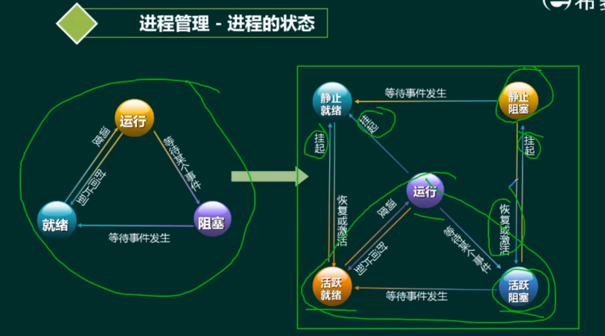
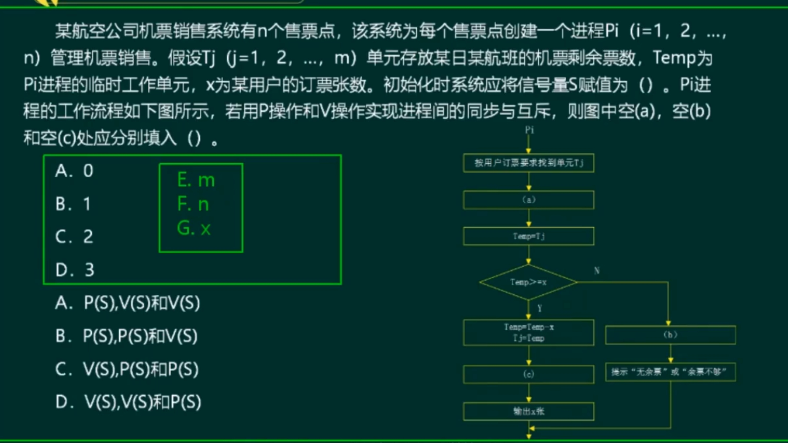
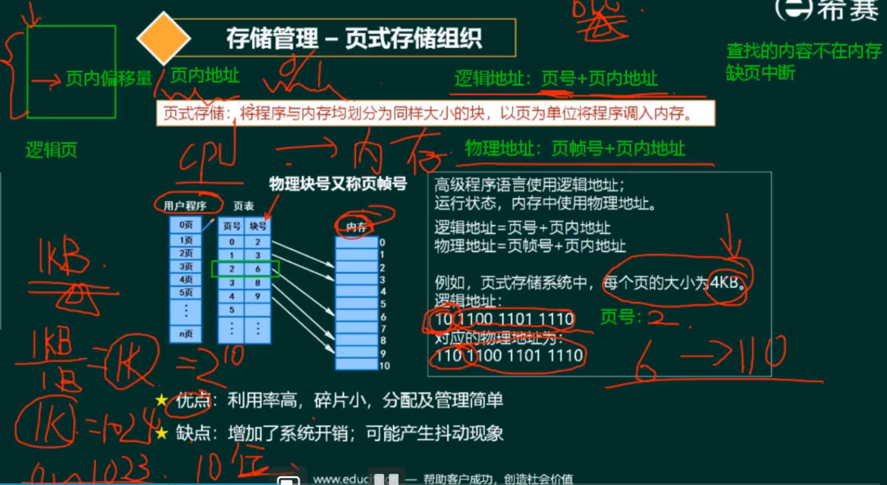
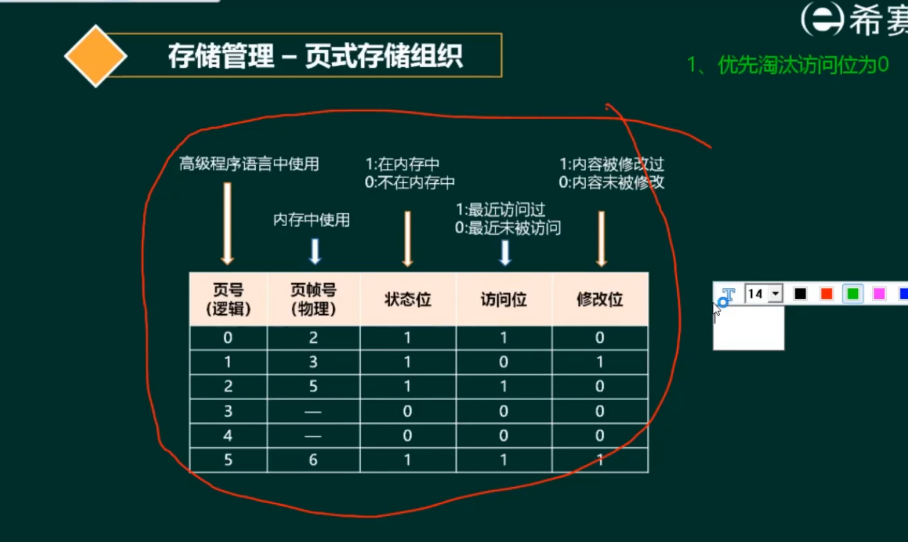
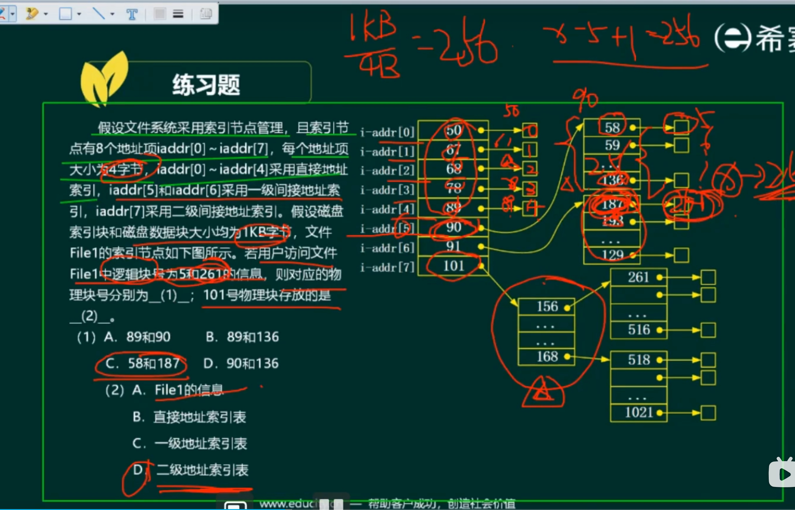

- 管理系统的硬件、软件、数据资源
- 控制程序运行
- 人机之间的接口
- 应用软件和硬件的接口

- 进程、存储、文件、作业、设备管理

- 进程管理
  - 进程的状态 ⭐ 
  - **前驱图 ⭐⭐⭐⭐** 
  - **信号量与PV ⭐⭐⭐⭐⭐**
  - 死锁与银行家算法 ⭐⭐
- 存储管理
  - **段页式存储 ⭐⭐⭐⭐**
  - 页面置换算法 ⭐
- 文件管理
  - 绝对路径与相对路径 ⭐
  - **索引文件 ⭐⭐⭐**
  - 位示图 ⭐⭐
- 作业管理(没出现过)，了解概念
- 设备管理
  - 虚设备与SPOOLING技术 ⭐
- 微内核操作系统（内核态、用户态）
- 嵌入式操作系统

# 进程管理

## 进程状态
> CPU资源比较珍贵
- 三状态模型-->五状态模型
- 就绪（活跃、静止）、运行、阻塞（活跃、静止）
- 添加挂起-->添加活跃、静止概念
> 隐喻策略：医生挂号。

## 进程管理（前驱图）
> 前驱后继逻辑关系
- 1.{（a，b）, ...}，起点终点顺序。
- 2.并行顺序没有要求。
- 3.直接制约与间接制约

- 进程的同步与互斥
  - 资源竞争-->互斥
  - 1.大家共享使用。
  - 2.某一时刻只能允许一个进程使用。
  - 临界资源：需要互斥才能使用的资源。
  - 临界区（代码）
  - 信号量：特殊变量
  - 同步：速度有差异，一定情况下停下等待。
    > 隐喻：多人步行到终点。
- 生产者消费者问题
  > 隐喻：零售中转站
  - 缓冲区（单缓冲区、多缓冲区）

## 信号量与PV
> 隐喻：资源的申请、占用、数量
- 1.全局变量
- 2.P与V操作（P减，V增）
  - 检查队列（判断信号量 与 0 的关系）
  - P：不满足条件-->加入队列 (<0)
  - S：满足条件-->唤醒队列 （<=0时）
> 隐喻：生产者消费者（PV）
- 例子：
  - 检查资源是否足够使用P（踢到阻塞队列）
  - 释放资源使用V
- 缓冲区大小-->初始值
- 并发：两者相同（选择一个先执行）
- 注意，先执行当前的（V之后继续执行），执行完或者阻塞后再切换。（例题3，不贴图了）

- 假设：同一个时刻，只有一个进程能够访问缓冲区。

- 前驱图中的PV，开始前P，结束后V。

## 死锁与银行家算法
- 死锁条件
  - 1.互斥
  - 2.保持和等待
  - 3.无法剥夺
  - 4.循环等待
- 不会死锁：平均分配+1？
  - -->其他求法，所有都(wi - 1) + 1
- 避免死锁的方式（打破四个条件）
  - 有序资源分配
  - 银行家算法：分配资源的原则
    > 隐喻：银行
    - 1.进程对资源的需求量 小于 已有的资源
    - 2.进程可以分期请求资源，总数不可超过最大需求量。
    - 3.现有资源无法满足，可以分期满足，但是一定会在有限时间内得到资源。
    - 例子->...
    - 1.统计已分配资源数。
    - 2.统计剩余可用资源数。
    - 3.计算所有进程剩下资源数。

# 存储管理
## 段页式存储
- 页式存储：**将程序与内存均划分为同样大小的块，以页为单位将程序调入内存。**
  > 隐喻：书本、讲义
  - 用户程序，页表，内存
    - 逻辑地址：页号 + 页内地址
    - 物理地址：页帧号 + 页内地址
  - 优点：**利用率高，碎片小，分配管理简单**
  - 缺点：增加系统开销（地址转化等） ，可能产生抖动现象。（频繁产生缺页中断，增加内存不能解决问题的情况）
  - 其他：缺页中断
  
  - 页面淘汰
    - 淘汰算法-->局部性原理
    - 1.优先淘汰访问位为0的。
    - 2.其次考虑修改位为0的。（写回代价）
    - 状态位（内存、外存）、访问位、修改位
    - 
- 段式存储
  - 按用户作业的自然段来划分**逻辑**空间，然后调入内存，段的长度可以不同。
  - 优点：多道程序共享内存，各段程序修改互不影响。
  - 缺点：**内存利用率低**，**内存碎片浪费大**。
  - 段表：段号，段长，基址
  - **合法段地址的判断**：段号 + 段内偏移量

- 段页式存储
  - 先分段，再分页
  - 优点：空间浪费小、存储共享容易、存储保护容易、能动态连接
  - 缺点：管理软件的增加，复杂和开销增加，需要的硬件以及占用的内容有所增加，执行速度大幅度下降。

- 快表
  - 页表于cache
  - 慢表在内存上。

## 文件管理
- 索引文件结构
  > 隐喻：理解为指针、地址、盘块号
  - 直接索引、一级间接索引、二级..、三级
  - 文件大小
  - 物理块大小 （4KB）
  - 盘块号大小（4B），是一个编号
  - 物理盘块编号
  - 结构
    - 索引节点（13个）
    - 一级索引：4KB-->每个大小4B->1024个索引。
    - 一级索引的物理盘块编号-->9 + 1024
  

- 文件和树形目录结果
  > 多级目录结构
  - 文件属性：R、A、S、H
  - 文件名组成：驱动号、路径、主文件名、扩展名
  - 绝对路径、相对路径-->

- 空闲存储空间的管理
  - 空闲区表法（空闲文件目录）
  - 空闲链表法
  - 位示图法
    - 
  - 成组链接法

## 设备管理
> I/O
- 数据传输控制方式
  - 程序控制（查询）方式
    - 无条件传送和程序查询（效率低）
  - 程序中断方式
    - 如键盘
  - DMA方式（DMAC处理）
    - 主存和外设实现高效、**批量**数据交换而设置的。（如硬盘）
  - 通道方式（专门机器）
  - I/O处理机
- 虚设备和SPOOLING技术
  - 打印机-->作业列表排队（假脱机技术）

## 微内核操作系统
- 单体内核
  - 所有...都在单体内核
  - 运行效率高
  - 稳定性和安全性不好
- 微内核（基本功能+）
  - 用户态和核心态
  - 可靠性、稳定性、安全性高
  - 效率不如单体内核

## 嵌入式操作系统
- 特点
  - 微型化、代码质量高、专业化、实时性强、可裁剪、可配置
  - 内核服务：异常和中断、计时器、I/O管理
  - 常见的：RTOS，要求非常奥

- 可裁剪可配置
- VxWorks 与 RT-Linux对比

