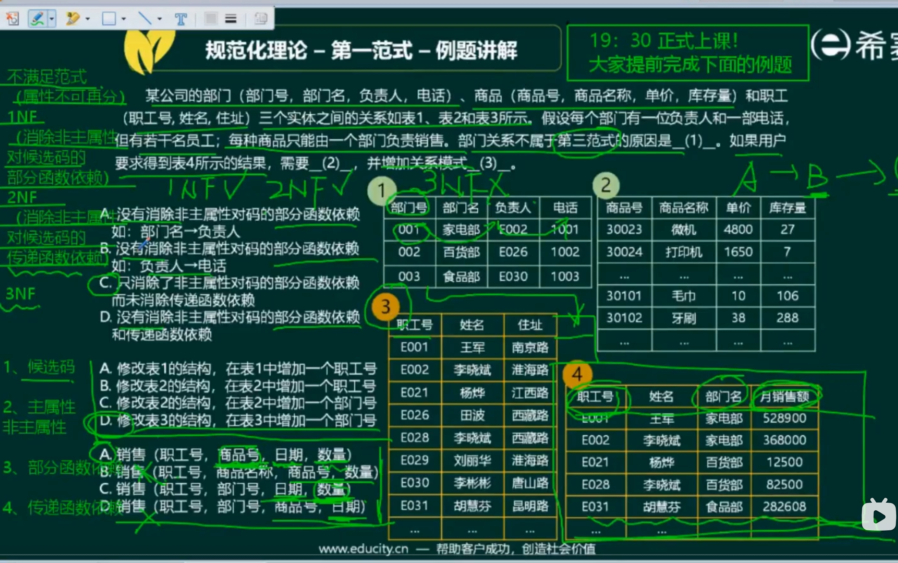
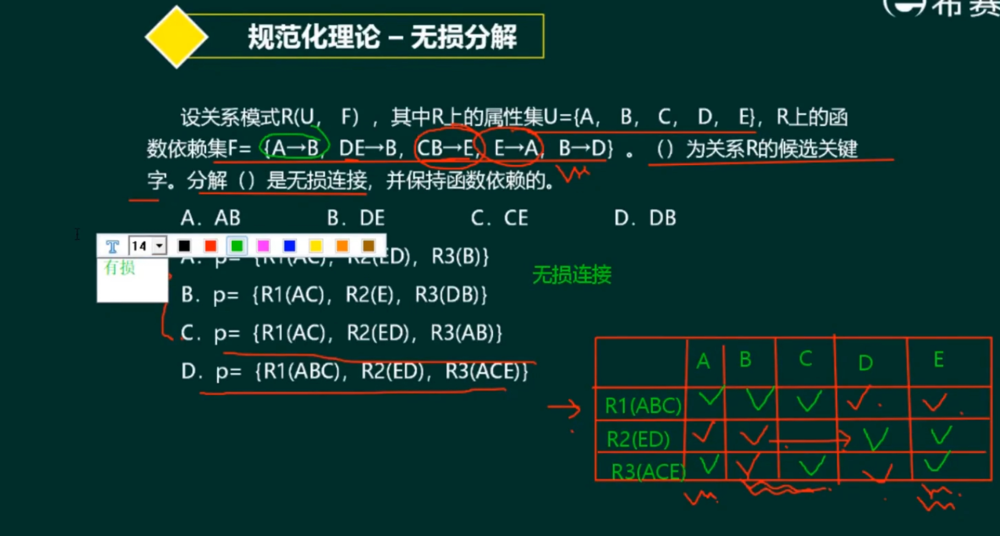
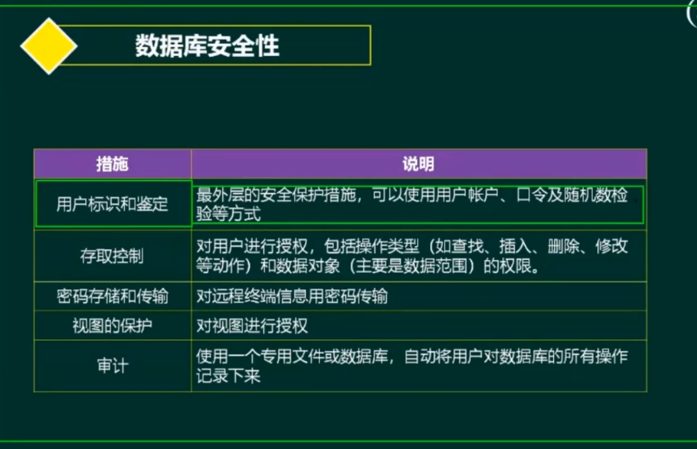
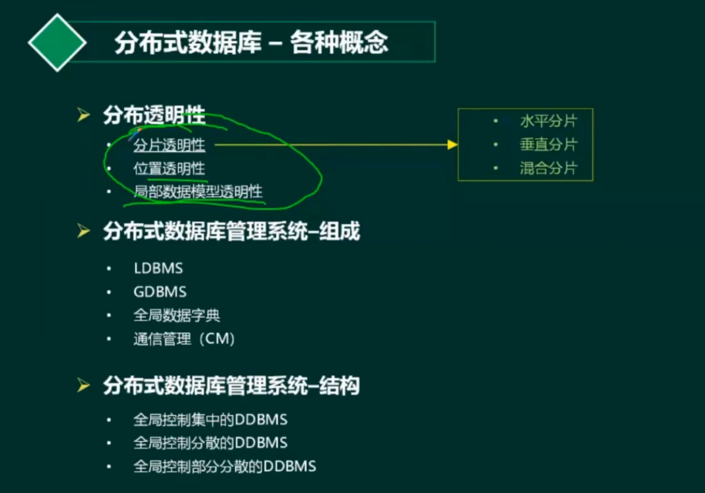
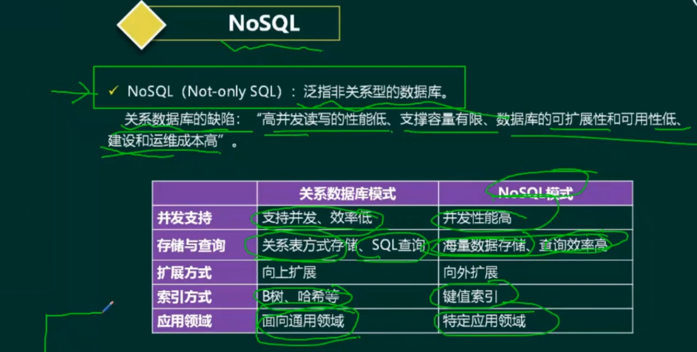
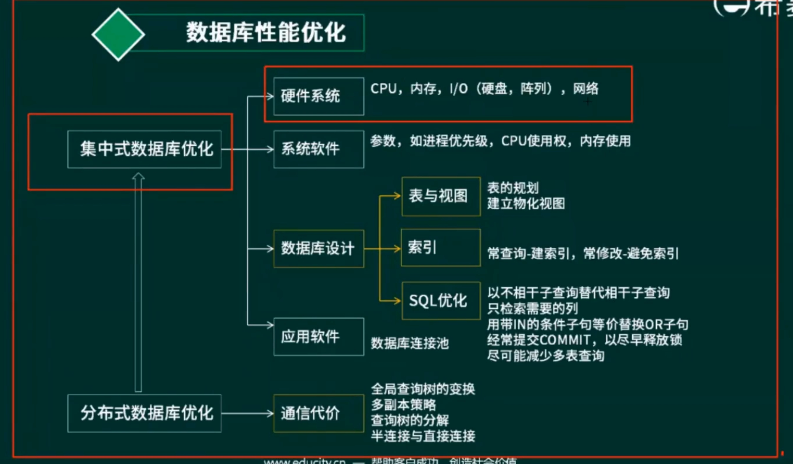

- 数据库模式 ⭐⭐⭐⭐（重要2）
- ER模型 ⭐
- 关系代数 ⭐⭐⭐（重要3）
- 规范化理论 ⭐⭐⭐⭐⭐（重要1）
- 
- 并发控制 ⭐
- 数据库完整性约束 ⭐⭐
- 分布式数据库 ⭐⭐⭐
- 数据仓库与数据挖掘 ⭐⭐⭐

数据冗余、更新异常、插入异常、删除异常
## 数据库模式
三级模式-两层映射
- 三级模式：外模式（视图，用户模式）、概念模式（基本表）、内模式（文件存储、物理）
  - 视图：**逻辑**独立性（基本表改变时，不需要改变）
    - 概念模式映射
  - 内模式映射
    - 物理变化
    - 物理独立性

- 视图：可能是SQL语句。
  - 一般是多表查询
  - 优点：简化用户操作、多角度看数据、逻辑独立性（重构）、保护机密数据。
  - 缺点：效率低
  - 其他：物化视图

- 设计
  - 需求分析（需求说明书、数据流图、数据字典）
  - 概念结构设计——ER模型（数据建模的工具————软件工程）
    - 不同-->与系统不同。
  - 逻辑结构设计——关系模式（二维表）
  - 物理设计（DBMS）
    - 聚簇索引

## E-R模型
- 设计
  - 联系类型：1-1，1-n，m-n，三个以上实体多元联系
- 集成方法
  - 一次性继承、局部集成
- 集成冲突
  - 属性冲突（同一个属性，不同范围）（例子：男生女生、01）
  - 命名冲突——意义、命名
  - 结构冲突
    - 某个对象完全不一样

## 关系代数
- 垂直：属性列
- 水平：元组行（一条记录）

- 并、交、差（结构一定一样）
- 笛卡尔积（×）：m*n条记录。（列（加）、行（×））
- 投影（Π）：针对列-->列的属性名
  - 条件
- 选择（σ）：针对行
- 自然连接（**认为性能高**）：（列：去重），元组行（同名取值列相同）
  - 等价的笛卡尔积
  - 先投影再选择（会错误）
    - 投影的时候已经把条件干掉了
  - **先选择再投影**
> 如果可以的话，先选择和投影，再进行自然连接或者笛卡尔积。

SELECT 投影
FROM 笛卡尔积
WHERE 选择

### 规范化理论
- 函数依赖
  - 全部函数依赖
  - 部分函数依赖
  - 传递函数依赖
- 主键：唯一标识元组的属性集合
  - 超键、候选键（身份证号与学号两个，可能是组合键）
  - 主键（任选一个）
  - 外键：其他关系的主键
- 范式
  - 1NF->属性值不可再分（简单属性）
  - 2NF->部分依赖
  - 3NF->传递依赖
  - 4NF->主属性对副属性的传递依赖与部分依赖
  - BCNF->左侧的每个依赖决定因素一定要包含某个候选码
- ER图规则：将联系转到多的一端
  - 职工指定部门

- **求候选键**-->注意，候选键包含的键都是主属性
  - 有向图表示
  - **入度为0**-->可遍历有向图-->是候选键
  - 键集合-->可遍历有向图-->是候选键
- **快捷判断**
  - 候选键是单属性至少满足2NF（不存在部分依赖）
  - 没有非主属性满足3NF（不存在对非主属性的传递依赖）
- **BCNF的范式的判断**
  - 1.所有候选键
  - 2.判断所有依赖是不是依赖1。
- **无损分解**
  - **保持函数依赖分解**
  - 无损分解、有损分解
  - 表格法分析过程
    - 做自然连接
    - 注意还要有对应连接出发的函数依赖
  
  - 注意：无损分解使用表格法
  - 函数依赖依靠判断

- Amstrong公理
  - 自反
  - 增广
  - 传递

- 反规范化（因为规范化可能效率低）
  - 增加派生冗余列
  - 增加冗余列
  - 重新组表
  - 分割表

## 并发控制
- 事务
- A（不可能做一半）C（行为变化）I（其他事务隔离）D（状态）属性
- 并发问题
  - 更新丢失
  - 不可重复读
  - 脏数据
- 封锁协议
  - S（读或共享）、X（排他）
  - 一级封锁（X）
  - 二级封锁（X、+R）
  - 三级封锁（，R事务结束才可）
  - 两段锁（可串行化）
- 死锁

## 数据库完整性约束
- 实体完整性-->主键，唯一且非空
- 参照完整性-->外键，其他关系的主键非空
- 用户自定义完整性————CHECK
- 触发器-->监听，一致性
  - 复杂完整性约束问题

## 数据库安全性

- 身份、权限、密码、视图、审计

## 数据备份
- 冷热备份
- 完全备份
- 差量备份（完全备份后的增量）
- 增量备份（上一次差量后的增量）

- 日志文件-->改变的记录。
  - 先日志，数据

## 数据库故障与恢复
- 可预期-->本身逻辑
- 不可预期-->算术溢出-->日志
- 系统故障-->系统坏了-->检查定点法
- 介质故障-->介质坏了

## 分布式数据库

- 数据分表（逻辑一张表
- 数据库分区（逻辑不同表，不同存储）

- 联邦数据库？（多数据库管理系统）
- 分布式
- 异构性
- 自治性
- 透明性

- NoSQL 非关系型数据库
  - 性能！
  - 高性能、高并发。
  - 海量数据存储、查询效率高
  - 外扩展
  - 特定领域
  - 
- 内存数据库

- 数据库性能优化
  - 

## 数据仓库与数据挖掘
- 大数据
- 

