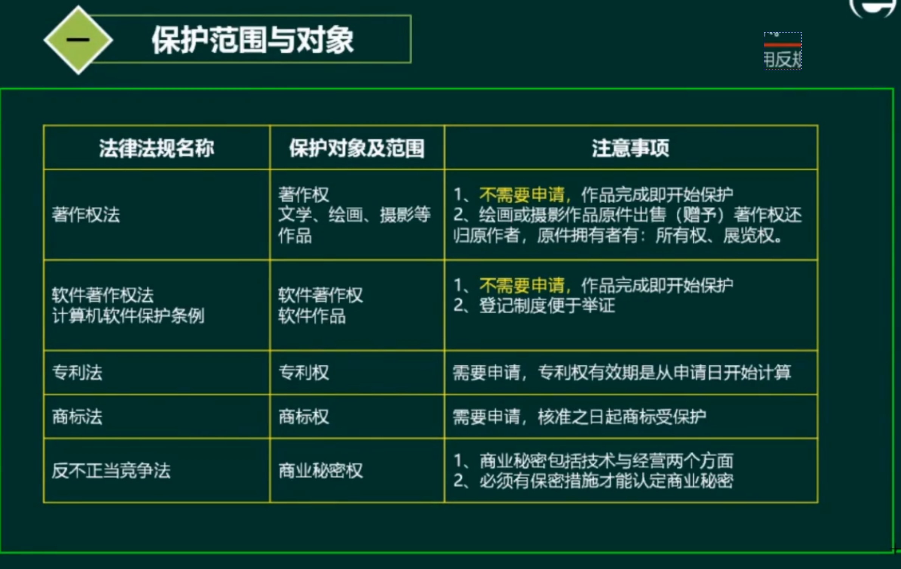

- 保护对象与范围 ⭐⭐⭐
- 保护期限 ⭐⭐
- 知识产权人确定 ⭐⭐⭐
- **侵权判断** ⭐⭐⭐⭐
- 标准分类 ⭐
- 标注代号识别 ⭐

## 知识产权人确定
作品、软件、专利

## 侵权判定

- 不论发表-->著作权
- 业务逻辑程序
- 法律

- 侵权与非侵权

- 保护期限

## 标准分类

- 国家标准：GB

- 标准代号
  - 我国：GB、GB/T、GB/Z、实物标准GSB
  - 行业标准：电子SJ
  - 地方：DB
  - 企业：Q+企业代号

