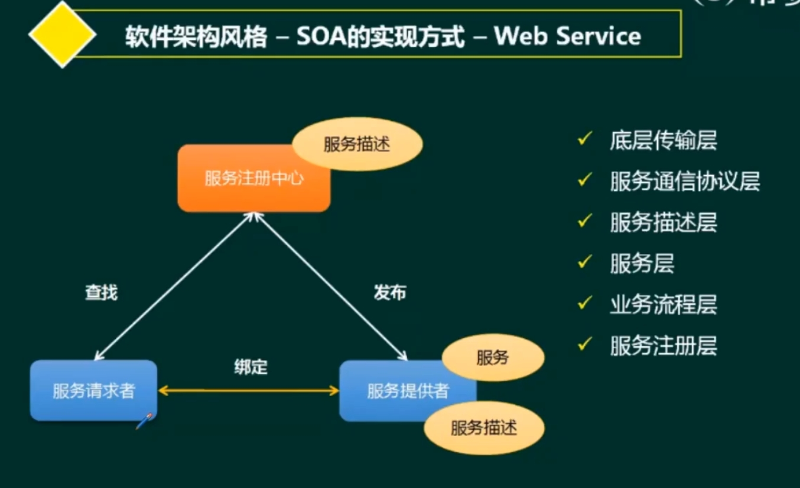
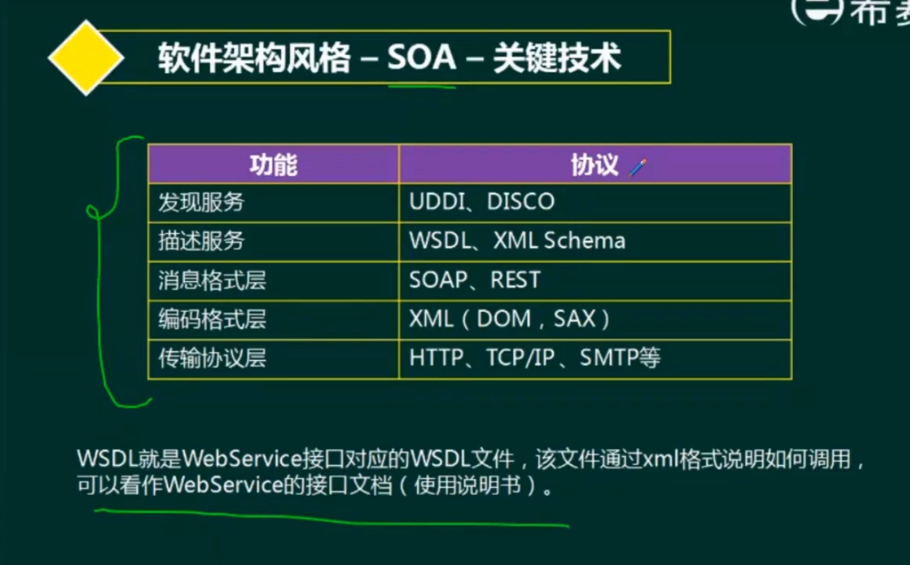
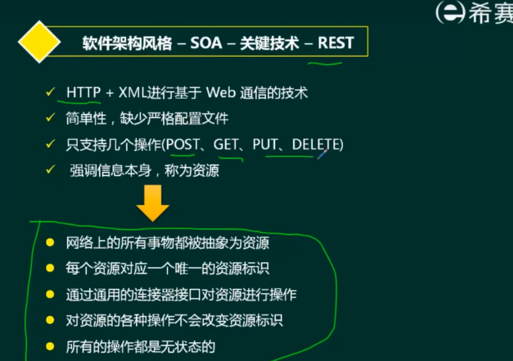
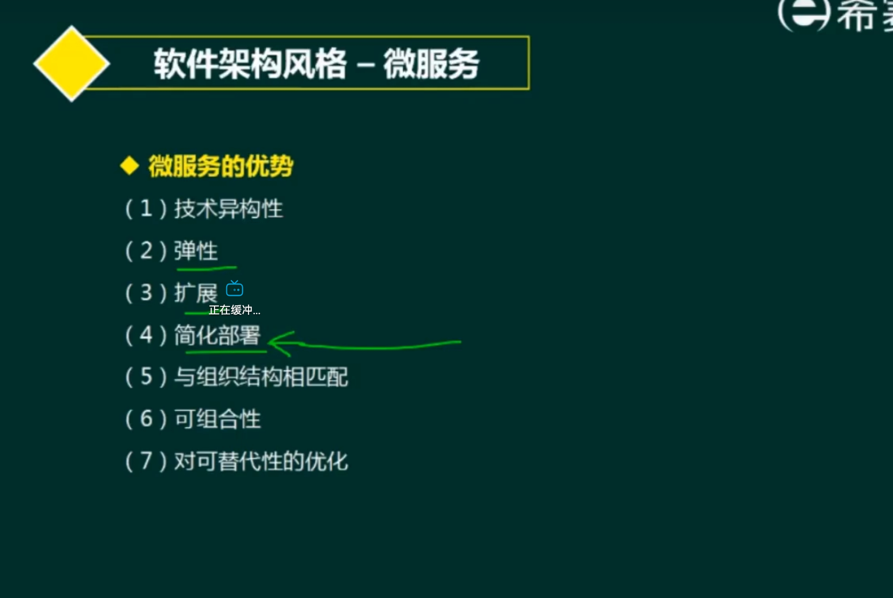

> 分析维度思考：性能、可靠性、可修改性、可维护性、稳定性、易扩展性、成本。
> 隐藏、抽象
**ESB相关概念提供一种思路**
- 1.提供位置透明的消息路由与寻址服务。
- 2.提供服务注册和命名管理
- 3.支持多种的消息传递范型。
- 4.支持多种可以广泛使用的传输协议
- 5.提供日志和监控功能

- 软件架构的概念 ⭐⭐⭐
- [软件架构风格](##软件架构风格) ⭐⭐⭐⭐⭐ （第一个研究）
  - 1.架构风格区分
  - 2.其他架构风格分析
    - Web相关概念了解。
- 架构描述语言ADL ⭐⭐⭐
- 特定领域软件架构 ⭐⭐⭐
- 基于架构的软件开发 ⭐⭐⭐⭐
- 软件质量属性 ⭐⭐⭐⭐⭐
- 软件架构评估 ⭐⭐⭐⭐⭐
- 软件产品线 ⭐⭐⭐
- 构件与中间件技术 ⭐⭐⭐⭐
- [Web架构设计](##Web架构设计) ⭐⭐⭐⭐⭐ （第二个研究）

**主线**
- 概念
- 风格
- 设计
- 评估
- Web应用技术维度

## 软件架构的概念
- 软件架构概念
  - 1.所处的位置。（原因，时间比较延后-->需求分析（业务层次）、软件设计（技术层次））插入其中。
    - 客户在需求分析阶段-->软件设计（鸿沟）
    - --> 架构设计：需求分配-->需求的职责分配到**组件**上。
    - **风格：体系结构，词汇表、约束-->约束、构件、连接件**
    - 作用
      - 可传递、可复用
      - 高级抽象-->元素组成、交互、描述、约束。
      - 质量、组织管理
  - 2.软件架构风格（一种特定应用领域的系统组织方式的**惯用模式**）
    - 上面
    - 1.核心问题：架构级的软件复用
    - 2.结构和语义特性，组织成完整系统
    - 3.描述系统、指导构建的系统。
  - 3.4+1模型与UML的一一对应关系
    - 逻辑（**功能**）、开发、进程（性能）、物理（部署视图，软硬件等）
    - 人员、内容
  - 4.理解主要的架构风格
    - 数据流
    - 调用/返回（主程序）
    - 独立构件
    - 虚拟机
    - 仓库

## 软件架构风格
> 论文：软件架构风格的应用？案例分析：系统中用到什么样的架构风格？特点、优势。选择判断...

- 1.架构风格判断（✔）

### 数据流风格
过滤器、工序、管道-->流通
- 特点：
  - 批处理序列（**数据完整**）
  - 管道-过滤器（单个单个，对输入数据流的变换）
    - 例子：视频、早期编译器

### 主程序/子程序（调用返回），层次型架构风格
- 调用返回的机制，**层次性关系**。
- 支持抽象层设计，复杂问题可以分解为**增量步骤序列**
- 缺点：不是所有系统都可以分层。很难找到一个合适的抽象方法。效率问题。
- 优点：分层的优点（上下影响、抽象级别不同）、

- 更多
  - 2层C/S、3层C/S、三层B/S、混合架构
  - 表示+数据层 各种特点
    - 成本、复杂性、移植性、维护性、可修改性、性能
  - 表示层+数据层+功能层
    - 服务器（1~2个）、客户端（表示、功能）
  - 三层B/S目的（尽可能不要依赖于客户端）
    - 小程序系列
    - 性能、安全性、动态页面支持能力
    - 页面为单位（动态交互性不强）
    - 补充内容
      - 表示层：MVC(三角关系）、MVP（P作为中间层）、MVVM（双向绑定， V和M）
      - 中间层
      - 数据访问层：ORM
      - 数据架构层

### 独立架构风格（独立构件）
> 如何独立-->不直接关联
- 进程通信
  - RPC、点对点、同步异步
- 事件驱动系统（隐式调用）

### 虚拟机风格（自定义需求的场景）
- 解释器
  - 包含一个能够完成解释工作的解释引擎。
- 基于规则的系统（人工智能、DSS）

### 仓库风格
以**数据为中心**的风格
- 数据库系统
- 黑板系统（信号处理、问题规划、编译器优化、语音）
- 超文本系统
  - 网状信息组织方法

### 闭环控制
关键词：反馈循环
- 适合于嵌入式系统，涉及连续的动作与状态

### C2风格
- 构件、连接件（底部顶部）
- 连接件--> 一条线。
- 构件-->线与线之间的东西。

### MVC架构风格
M（数据逻辑）、V（数据处理显示）、C（用户交互）
- J2EE：
- V：对应JSP
- C：对应Servlet
- M：对应Entity Bean、Session Bean
- 其他：主动MVC、被动MVC，提醒修改的是M还是C

### MVP架构风格

### MVVM（层次隔离开）

### RIA富互联网应用
- 优点：C/S（反应速度块，交互性强）、B/S的优点。（容易传播）
- 缓存
AJAX
打开慢，之后的运行表现力强
缓存

### 基于服务的架构
服务：一种逻辑组合。
典型SOA服务：ESB总线
- 核心：标准化。（旧系统使用服务封装）
- 特点：粒度、标准、语言无关（协议多）、服务提供简单。
- 具体实现：Web Service
  - 服务注册、请求、提供

- 标准实现方式：ESB
- 1.提供位置透明的消息路由与寻址服务。
- 2.提供服务注册和命名管理
- 3.支持多种的消息传递范型。
- 4.支持多种可以广泛使用的传输协议
- 5.提供日志和监控功能

- 发现服务 UDDI
- 描述服务 WSDL
- 消息格式层 SOAP
- 编码格式层 XML
- 传输协议层

- REST
  

### 微服务
特点
- 小，专注
- 轻量级通信机制
- 松耦合、独立部署

- 挑战：复杂、成本、部署、测试、管理

### MDA（净室）
核心：分离实现和规约
可移植、互通、可重用

**风格概览**
- 数据流风格：批处理序列，管道过滤器
  > 网络通信先包头分离，然后再报文解析，后续处理。  
  - 适合数据处理，一步一步得到结果
  - 例子：编译
- 调用/返回风格：主程序/子程序、面向对象、`层次结构`
- 独立构件风格：进程通信、事件驱动系统（隐式调用）
  > 断点，监视器做事情->隐式调用。
  > Windows图形方面 --> 事件驱动系统
- 虚拟机风格：解释器、基于规则的系统（偏向于专家系统）
  > Java、游戏开发自定义地图（解释器引擎支撑）
  - 工作流风格-->解释器
- 仓库风格：数据库系统、超文本系统、黑板系统
  > 集成编译环境，注意跟断点调试不一样。  
  > 语音识别（经典黑板）
- 其他风格：
  - 闭环控制
  - C2风格

> 机器人：过程调用（闭环控制）、解释器（自定义）、隐式调用？（选了这个，有瑕疵）  

### 具体风格介绍
- **数据流风格**
  > 没有用户交互
  - 批处理序列
    - 数据必须是完整的，以`整体`的方式传递
  - 管道过滤器
    - 过滤器：类似于函数、方法等
    - 管道：调用机制等（连接过滤器的方式）
      - 早期的编译器就采用这种架构。要一步一步处理的，均可考虑采用此架构风格。
      - 支持数据流的处理，连接件就是数据流传输的管道。
        - （视频）
- **调用/返回风格**
  - 应用最为广泛的架构风格
  - 分类
    - 主程序/子程序
      - 单线程控制，问题划分为若干个处理步骤，构件即为主程序和子程序，子程序通常可合成为模块。过程调用作为交互机制，即充当连接件的角色。
      - 调用关系具有层次性，语义逻辑表现为主程序的正确性取决于它调用的子程序的正确性。
    - 面向对象
      - 构件是对象，对象是抽象数据类型的实例
    - 层次结构
      - 构件组织成一个层级结构
  - 优缺点
    - 优点（解耦、等。。。）
      - 1.这种风格支持基于可增加抽象层的设计，允许将一个复杂问题分解成一个增量步骤序列的实现。**简化复杂问题**
      - 2.不同的层次处于不同的抽象级别
        - 底层：抽象级别越高
        - 顶层：抽象级别越低
      - 3.每一层最多影响两层。**利于复用**
    - 缺点
      - 1.很多系统不好分层（效率等）
      - 2.很难找到一个合适的、正确的抽象方法。
- **`独立` `构件`风格**
  > 不直接关联-->消息、事件
  - 进程通信
    - 消息传递的方式：点对点、同步或异步、远程过程（方法）调用。
  - 事件驱动系统（隐式调用）
    - 注册、分发。
- 虚拟机风格（层次比设计模式的解释器模式更高）
  - 解释器（更普遍）
    - 解释引擎（可以完整解释工作）、存储区（代码）、数据结构（工作状态）、数据结构（进度）
    - 虚拟机
  - 基于规则的系统（更高级
    - 解释引擎+知识层面的东西，`人工智能`、`辅助决策领域`
- **仓库风格（中心仓库+一堆处理部件）**
  - 数据库系统
  - 黑板系统
    - 黑板共享数据
    - 信号处理、问题规划和编译器优化等复杂问题-->使用黑板系统
  - 超文本系统（**归属于仓库风格**）
  - `现代集成编译环境采取仓库风格`
    - 语法树-编辑器、调试器、变量监控、断点（管控语法树）

**其他架构说明**
- 闭环控制架构（过程控制）
  - 反馈循环
  - 适合嵌入式系统，涉及连续的动作与状态
  - 基本结构
    - 给定值、比较器（反馈量与给定值）、控制器、执行器、被控对象
    - 反馈环节
- C2风格（分层机制）
  - 并行构件网络
  - 顶部和底部的连接

**用的比较多的架构风格细讲**
- 层次架构风格（调用/返回风格）
  - 两层C/S（移植维护复杂）、三层C/S（表示层、功能层、数据层）、三层B/S（小程序）（页面为单位，动态交互性不强，不安全）、混合架构（内、外使用B/S与C/S）
    - 三层B/S
      - 表示层：MVC、MVP、MVVM
      - 中间层
      - 数据访问层：ORM
      - 数据架构层
- MVC架构风格（有主动和被动）
  - J2EE体系结构
    - V：JSP
    - C：Servlet
    - M：Entity Bean、Session Bean
- MVP架构风格
  - 核心：解耦
  - V和M的解耦（分层）
- MV（VM）架构风格
  - VM做双向自动绑定
- 富互联网应用（RIA）
  - 结合C/S架构，B/S架构-->缓存
- **SOA**：基于服务的架构（跨平台、跨语言）
  - 标准化
  - 服务总线（ESB）--> 中介者的角色，信息路由。
  - 服务
    - 服务接口
  - 特点
    > 服务、构件、对象讨论特点。
    - 松散耦合
    - 粗粒度
    - 标准化接口
  - 实现：Web Service
    - 服务请求者、服务提供者、注册中心（WSDL协议？）
    - 底层传输层、服务通信协议层、服务描述层、服务层、业务流程层、服务注册层
    - 静态绑定（不需要注册中心）、动态绑定（通过注册中心来绑定）
  - 实现：ESB
    - 提供透明的消息路由和寻址服务（不需要管谁提供服务）
    - 注册和命名
    - 多种消息传递范型
    - 多种传输协议
    - 多种数据格式及互转
    - 提供日志和监控功能
  - 实现：服务注册表（差不多）
  > Web Service 和 ESB 的区别？可互补。
  - 关键技术
    - UDDI...
    - WSDL、XML Schema
    - XML（DOM、SAX）
    - SOAP:HTTP+XML
    - REST:抽象资源
      - **无状态**
- 微服务风格（面向服务架构的一种）
  - 特点
    - 小、专注于一件事
    - 轻量级的通信机制
    - 松散耦合、独立部署
    - 比喻：雕版印刷和活字印刷。
    > 容器技术发展
  - 优势
    - 技术异构性
    - 弹性
    - 扩展
    - 简化部署（自动化部署）
    - 与组织结构相匹配
    - 可组合性
    - 对可替代性的优化
  - 挑战
    - 分布式系统的复杂性
    - 运维成本
    - 部署自动化
    - DevOps与组织结构
    - 服务间依赖测试
    - 服务间依赖管理
  - **微服务和SOA的对比分析**
    - 微服务                      SOA
    - 能拆就拆                整体的，服务能在一起就在一起
    - 纵向业务划分            水平划分
    - 单一组织负责            按层级划分不同部门的组织负责
    - 细粒度                  粗粒度
    - 两句话可解释明白        几百字代表SOA的目录
    - 独立的子公司            类似大公司划分了业务单元（BU）
    - 组件小                  存在较复杂的组件
    - 业务逻辑存在于每个服务中    业务逻辑横跨多个业务领域
    - 使用轻量级通信方式，如HTTP  ESB充当服务通信的角色（企业服务产总线）
  - **微服务和SOA的对比分析（实现）**

- MDA（模型驱动架构）
  > 一部分应用可行。（业务逻辑绕不开的）
  - Model（客观事物的抽象表示）、Architecture（构成系统的部件、连接件+规约）
  - 目标：可移植性、互通信、可重用性
  - 使用模型完成软件的分析、设计、构建、部署、维护等
  - MDA起源于分离系统规约和平台实现的思想。
  - 三种模型
    - 平台独立模型（PIM）↓
    - 平台相关模型（PSM）↓
    - 代码（Code）

## 架构描述语言 ADL
- ADL三要素：构件、连接件、架构配置
- ADL由哪几部分构成
  - 构件：计算或存储的单元
  - 连接件：用于构件之间交互建模的`体系结构构造块`及其支配这些交互的规则；
  - 架构配置：描述体系结构的构件和连接件的连接图
- 主要的ADL
  - Aespo、MetaH、C2、Rapide、SADL、Unicon、Wright

## 特定领域软件架构（DSSA）
> 参考模型、参考需求、参考架构
- 领域分析（领域模型）
- 领域设计（软件架构）
- 领域实现

- 垂直域
- 水平域

- 人：
  - 领域专家：理解为军师
    - 用户+专业工程师
  - 领域分析人员
  - 领域设计人员
  - 领域实现人员
- 三层次模型
  - 领域架构师——领域开发环境
    - 开发共性的东西（领域模型）
  - 应用工程师——领域特定的应用开发环境
    - 利用前者，结合用户需求
  - 操作员——应用执行环境

## 基于架构的软件开发方法（ABSD）Architecture、Base、Software、Design
- ABSD方法是`架构驱动`，即`强调由业务、质量和功能需求的组合驱动架构设计`
- 从总体功能架构明确，此时未完成需求获取与分析
- 三个基础
  - **功能分解**
  - **选择`架构风格`实现质量和业务需求**
  - **软件模板的使用**
- 过程递归
- 视角（看问题角度）与视图（视图）
- `用例用来捕获功能需求、特定场景用于捕获质量需求`
  - 质量需求：非功能需求

**开发过程**
> ABSD可以很好地支持软件重用
- 架构需求过程
  - 需求获取、`标识构件（生成类图、对类进行分组、把类打包成构件）`、需求评审
  - 注意：**标识构件这件事的发生在需求**。
- 架构设计
- 架构文档化——`架构规格说明书、测试架构需求的质量设计说明书`
  - 文档从使用者角度编写
  - 必须分发给所有系统相关人员
  - 且必须保证开发者手上的文档是最新的
- 架构复审
  - `标识潜在的风险`，及早`发现架构中的错误与缺陷`。
- 架构实现
  - 构件库：分析与设计、构件实现、构件组装、系统测试
- 架构演化

## 软件架构评估（架构复审的地方）
- 为什么要进行架构评估？
- 架构评估到底评估什么？
- 架构评估怎么评？

**质量属性**
- 性能
  - 系统的`响应能力`
  - 代表参数：响应时间、吞吐量
  - 设计策略：优先级队列、资源调度
- 可用性
  - 正常运行的时间比例
  - 代表参数：故障间隔时间
  - 设计策略：冗余、心跳线
- 安全性
  - 向合法用户提供服务的时间能够阻止`非授权`用户使用的企图或拒绝服务的能力
  - 设计策略：追踪审计
- 可修改性
  - 较高的性能价格比对系统进行变更的能力
  - 主要策略：信息隐藏
- 可靠性（可用性和可靠性是一致的）
  - 主要考虑两个方面：容错和健壮性
  > 除非特地强调健壮性
  - 代表参数：MTTF、MTBF
  - 设计策略：冗余、心跳线
- 功能性
- 可变性
- 互操作性

**必要概念**
- 风险点：系统架构设计过程中，架构设计中存在的`隐患`，潜在的问题。
- 非风险点：提出一个要求，某某要求是可以接受的。
- 敏感点：为了实现某种特定的质量属性，一个或多个构件所具有的特性。
- 权衡点（尽可能选权衡点）：是一个特殊的敏感点
  - `影响多个质量属性的特点`，是多个质量属性的敏感点
- 方法
  - 问卷调查
  - 基于度量的方式
  - **基于场景的方式**
    - 刺激系统得到响应
    - SAAM（软件架构分析法）
      > 识别非功能性需求
      - 最初：**可修改性**
      - 问题描述、需求说明、架构描述-->SAAM-->场景开发（架构描述）、单个场景评估、多场景评估、总体评估
    - ATAM（架构权衡分析法）
      - 在SAAM上发展来的
      - 性能、实用性（可用性）、安全性、可修改性
      - 强调：**多属性的折衷与平衡**。
      - 流程
        - 场景收集
        - 架构视图和场景实现
          - 描述架构视图
          - 实现场景
        - 属性模型构造和分析
          - 质量效用树
        - 折中
    - CBAM（成本效益分析法）

## 软件产品线
- 结合了：软件架构、领域工程、DSSA
- 双生命周期模型
  > 分析、设计、实现，一环扣一环
  - 领域工程（做共性）
  - 应用工程（做个性化）
- SEI模型
- 建立方式
  - 现有产品、全新
  - 演化式、革命式
  - 四种方法
  - 现有+演化 --> 稳
  - 全新+革命式 --> 高风险
- 组织结构
  - 设立独立核心资源组
  - 不设立
  - 动态的组织结构
- 因素
  - 经验、资源、好的产品线架构、好的管理支持

## 构件和中间件（是构件的一种）
**构件的定义**
- 1.软件构件式一种`组装单元`，它具有规范的接口规约和显式的语境依赖。软件构件可以独立地部署并由第三方任意的组装。
- 2.....
- 3...
- **构件特性**
  - 1.独立部署单元
  - 2.作为第三方组装。
  - 3.没有外部的可见状态。
- 对象特性
  - 1.一个单元的实例，具有唯一的标识。
  - 2.具有状态。
  - 3.封装了自己的状态和行为。
- 模块的特性
  - 结构化开发的产物

**构件系统架构特性**

**构件的复用**
- 检索和提取构件。-->理解与评价构件-->修改构件-->组装构件。

**中间件（是一类系统软件）技术**
- 中间件是一种独立的系统软件或服务程序，可以帮助分布式应用软件在不同的技术之间共享资源
  - 1.系统软件：不直接给客户，给应用提供服务。（操作系统也是一种系统软件）
  - 2.一类：不止是一个
    - 消息中间件：Kafka
    - 对接数据库：JDBC、ODBC，对接不同系统。
    - 处理业务
  - 优点 
    - 面向需求。（对接工作减少）
    - 业务分隔与包容性。
    - 设计与实现隔离 
    - 隔离复杂的系统资源
    - 符合标准的交互模型
    - 软件复用
    - 提供对应应用构件的管理
- Corba（公共对象代理请求）
  - 客户端拥有一个服务端对象的引用
  - 伺服对象：CORBA对象的真正实现，负责完成客户端请求。
  - 对象适配器POA：屏蔽ORB内核的内核实现，为服务器对象的实现者提供抽象接口，以便他们使用ORB内部的某些功能。
  - 对象请求代理（Object Request Broker）：解释调用并负责查找实现该请求的对象，将参数传给找到的对象，并调用方法返回结果。客户方不需要了解服务对象的位置、通信方式、实现、激活或存储机制。 
  - 内容包含
    - 1.对象请求代理
    - 2.对象服务
    - 3.公共设施
    - 4.应用接口
    - 5.领域接口
- J2EE——分布式多层应用程序
  - 客户机、J2EE服务器、数据存储服务器
  - Bean运行于EJB容器之中
    - 会话Bean：描述了与客户端的一个短暂的会话。
    - 实体Bean：持久化数据，O/R映射
    - 消息驱动Bean：会话Bean+JMS，客户把消息发送给JMS目的地，然后，JMS提供者和EJB容器协作，把消息发送给消息驱动Bean。支持异步消息。
  - 容器：
    - Applet Container、Application Container、Web Container、EJB Container
  - 组件：
    - Applet、Application、JSP/Servlet、**EJB**
  - 服务：
    - H、R、..

---
## Web架构设计
- 从架构来看：MVC、MVP、MVVM、REST、WebService、微服务、中台
- 从缓存来看：MemCache、Redis、Squid
- 从并发分流来看：集群（负载均衡）、CDN
- 从数据库来看：主从库（主从复制）、内存数据库、**反规范化技术**、NoSQL、分区（分表）技术、视图与物化视图
- 从持久化来看：Hibernate、Mybatis
- 从分布存储来看：Hadoop、FastDFS，区块链
- 从数据编码来看：XML、JSON
- 从Web应用服务器来看：Apache、WebShpere、WebLogic、Tomcat、JBOSS、IIS
- 其他：静态化，有状态与无状态，响应式Web设计  
**演化过程**
- 单台机器：应用+数据库
- 应用和数据库分离
- 集群（应用服务器集群）：替代多个应用服务器
- 下一步？
  - 用户的请求由谁来转发到具体的应用服务器
  - 用户如果每次访问的服务器不一样，那么如何维护session的一致性
  - -->负载均衡
**负载均衡技术**
- **基于特定软件的负载均衡**（HTTP重定向）（应用层）
  - 类似于HTTP到某个网站的情况，然后被跳转
  - 特点：实现简单，但是性能较差
- 反向代理负载均衡（应用层）
  - apche、nginx
  - 反向代理机子可能出现性能瓶颈
- **基于DNS的负载均衡（传输层）**
  - DNS效率较高。但是一个应用服务器故障，不能及时通知DNS。
  - 减少维护负载均衡的服务器成本。
  - 不及时原因：多级缓存，生效时间有问题。
- 基于NAT的负载均衡（传输层）
  - 基于NAT的负载均衡将一个外部IP地址映射为多个IP地址，对每次的连接请求动态地转换为一个内部节点的地址。
  - 技术较为成熟，一般在网关的位置，可以通过硬件实现。（如四层交换机）
- **混合型负载均衡**  
**负载均衡算法**
- 静态算法（策略事先定死）：（加权）轮转算法、源地址哈希散列算法、目标地址哈希散列算法、随机算法
- 动态算法（考虑服务器负载）：（加权）最小连接数算法、加权百分比算法  
- 硬件负载均衡：F5
- 软件负载均衡：LVS、Nginx、HAproxy
> CDN补充内容：镜像站。CDN (内容分发网络) 指的是一组分布在各个地区的服务器。这些服务器存储着数据的副本，因此服务器可以根据哪些服务器与用户距离最近，来满足数据的请求。

**解决问题**
- 用户的由谁来转发到具体的应用？
- 用户如果每次访问的服务器不一样，如何维护session的一致性。
> 负载均衡 **有状态和无状态的问题**
- 1.cookie（客户端的存储）
- 2.redis

- 服务器压力
  - 主从库：数据库读写分离化
  - 用缓存缓解读库的压力
    - Memcached、Redis、Squid
    - 比较：Redis和Memcached
      - 同：均数据存于数据库，都是内存数据库。但是Redis支持**范围更广**，且支持**数据持久化**。
  - 难题：
    - 缓存雪崩-->大部分缓存失效，数据库崩溃
      - 1.缓存的高可用性质
      - 2.缓存降级（服务能力下降）
      - 3.Redis备份
      - 4.提前演练
    - 缓存穿透
      - 查询无数据返回-->查数据库
        - 空结果-->缓存一下
        - 使用布隆过滤器，拦截掉一些查询
  - CDN（内容分发网络）

- XML和JSON
  - XML
    - 优点：格式统一、符合标准，容易与其他系统进行远程交互，数据共享比较方便。
    - 缺点：XML文件庞大，文件格式复杂，传输占带宽。
    - 服务端和客户端解析XML非常复杂，代码不宜维护。
    - 不同浏览器解析XML不同，需要编写多份代码。
    - 解析费时间，费资源。
  - JSON
    - 简单，易于读写，带宽小，便于维护

- Web应用服务器两层意思
  - WEB服务器：Request请求，HTML页面
  - 应用服务器：业务处理。
  - 类型
    - Apache
    - IIS
    - Tomcat
    - WebSphere
    - WebLogic
    - Jetty
- REST
  - 五个原则
    - 抽象为资源
    - ULR进行标识
    - 通过通用的连接件操作
    - 操作不改变标识
    - 操作无状态
- 响应式Web设计
  - 理念：集中创建图片排版大小，智能修改页面**布局**
  - 流式布局和弹性化设计：使用相对单位。
  - 响应式图片：同比缩放图片，在小设备上降低自身分辨率。
- 中台
  - 中台是一套结合互联网技术和行业特性，将企业核心能力以共享服务形式沉淀，形成（“大中台、小前台”的组织和业务机制，供企业快速低成本地进行业务创新的企业架构。中台可以进一步细分，如业务中台、数据中台...
    > 本质上都是对企业通用能力在不同方面的沉淀，并对外能力开放。
  - Supercell
  - 业务中台和数据中台

