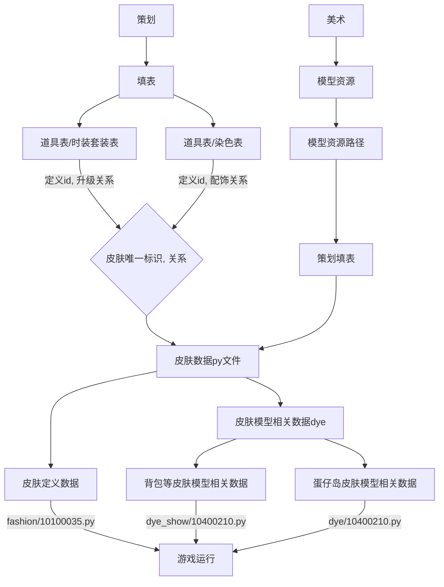
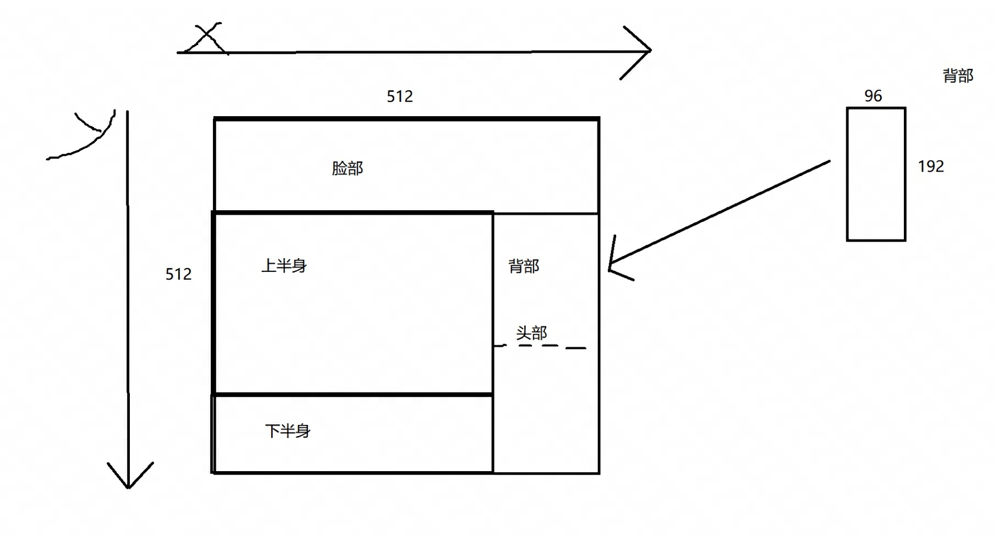
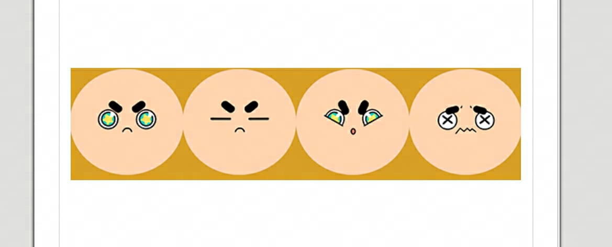

# 通知对象

四海(王敏杰)、

# 一、一个皮肤的诞生

一个皮肤能够在游戏里运行，依赖于多个职能，主要由策划配置好
- 道具表/时装套装表
- 道具表/染色表
- 模型运行时的数据
	- 皮肤py文件
	- 染色py文件：**代表一个模型的表现**
		- 染色低模：代表一个模型在蛋仔岛上的表现
		- 染色高模：代表一个模型在非蛋仔岛的表现，如背包等，需要有出场动画等。
> **皮肤和染色的关系**：皮肤是一份配置关系的文件，真正的一个皮肤的具体长成什么样子，是染色所定义的。举例来说，舞舞的皮肤id是10100334，染色是10403340，此时舞舞所有的展示都是舞舞。假设此时把舞舞的染色配置为10400210（“艾瑞和巴蒂”的染色），此时虽然所有的描述也好，商业化也好都是舞舞，但是使用舞舞的时候，展示的模型是“艾瑞和巴蒂”的模型。



# 二、皮肤编辑器对目录的拆分

**py文件相关的代码目录**
1. 使用py数据的脚本文件目录：
	- 游戏内的脚本目录：https://svn-u5.gz.netease.com/svn/ed2_code/season/client/script/custom/client/helper/model_data_helper
	- 在导表目录下的脚本目录：https://svn-u5.gz.netease.com/svn/season_branches/data/20220525/data/export/export_data/export/model_data_helper
3. 将脚本文件同时支持导表、游戏内的配置文件目录：https://svn-u5.gz.netease.com/svn/ed2_code/season/client/script/custom/client/helper/ModelDataPathConfig.py

> model_data_helper整个目录理论上是完全一样的，应该是复制粘贴的关系，由于被人改了，导致部分代码不兼容，但关于py文件相关的代码应该是完全一致的。


4. 为了能够对皮肤数据有足够良好的操控，即对新生成的“py皮肤数据”能够随时增、删、查、改，其具体不同目录下的需求如下表所示。

|   |   |   |   |   |   |   |
|---|---|---|---|---|---|---|
|模块分类\行为需求|增（数据生成）|增（转化生成）|删|查|改|数据类型|
|导表|√|√|√|√|√|python的dict数据|
|Sunshine（自定义接口）|√（通过游戏内）|×|√（通过游戏内）|√（通过游戏内）|√（通过游戏内）|dict数据，但自定义解析。|
|游戏内|√（间接需求）|×|√（间接需求）|√|√（间接需求）|python的dict数据|
|py数据目录（游戏内）|-|-|-|-|-|磁盘上的py文件|
|py数据目录（导表）|-|-|-|-|-|磁盘上的py文件|
|py数据目录（res目录）|-|-|-|-|-|磁盘上的py文件|

2. 增删查改代码需求说明
- **导表**和**游戏**内，同时需要增、删、查、改 --> 使用同一份代码。

3. 数据读取目录需求说明
- **游戏内**需要增删查改的目录：py数据目录（游戏内）、py数据目录（res目录）
- **导表**需要增删查改的目录：py数据目录（导表）

**由 2、3得出，在代码内，需要同时支持以下内容**
1. 导表和游戏内，同一份代码能够支持读取不同位置下的“py数据目录”。
2. 导表和游戏内，同一份代码，需要支持增、删、改、查
	1. 导表需要支持的增功能：数据生成、转化生成。
	2. 游戏内需要支持的增功能：数据生成。

**具体代码实现**
- 游戏内、Sunshine使用相同的ModelPathConfig文件，用于判断文件存储的路径
	- 将EXPORT_RES_DIR设置为1，运行时可以使用res目录（方便策划使用）
	-  此时**导表**、**游戏内**通过ModelPathConfig类的不同配置，允许读不同父目录（一个在output下，一个在data下）下的py数据目录
![[Pasted image 20231108165730.png]]

- 注：
	- ModelPathConfig目前承担了两个职责
		- 使策划使用res目录
		- 导表和游戏内，能够采用不同的路径进行import
	- 为了代码能够在导表、游戏内兼容，数据做了try、except的判断


# 三、皮肤相关的数据有哪些，不同的皮肤数据有什么区别？

**皮肤的数据有哪些？**
- 皮肤、配饰、散件、散件套装、载具的py文件
	- 皮肤：fashion_id.py、dye_id.py、dye_id.py（高模）
	- 配饰：accessory_id.py、accessory_dye_id.py、accessory_dye_id.py（高模）
	- 散件：part_id.py、part_id.py（高模）
	- 散件套装：part_suit_id.py
	- 载具：vehicle_id.py、vehicle_dye_id.py
- 用于服务端与快速查询的py文件


**不同的py文件有什么区别**（其他同理）

- 皮肤
	- fashion_id.py：1. 皮肤的概念集合。2.该皮肤必定使用的数据。
	- dye_id.py（低模）：用于存储一个皮肤在战斗、蛋仔岛上所需的数据。
	- dye_id.py（高模）：用于存储一个皮肤在高模展示、出场动画所需的数据。


# 四、皮肤贴图结构


**皮肤的基本贴图结构**




**脸部贴图结构**




```python

# copy_block函数解析
up_m_tex.copy_block(((ori_up_m_tex, 0, width / 4, 0, width / 4, width, height * 3 / 4), (f_m_tex, 0, 0, 0, 0, width, height / 4)))

source: up_m_tex
target: ori_up_m_tex、f_m_tex
(贴图, s_x, s_y, t_x, t_y, width, height)

贴图拷贝逻辑介绍
1. 获取贴图。
2. 将贴图copy到对应的位置。
3. 切换模型上的贴图

# 基本贴图的路径：需要查看点击即可
1. 脸部贴图

```


