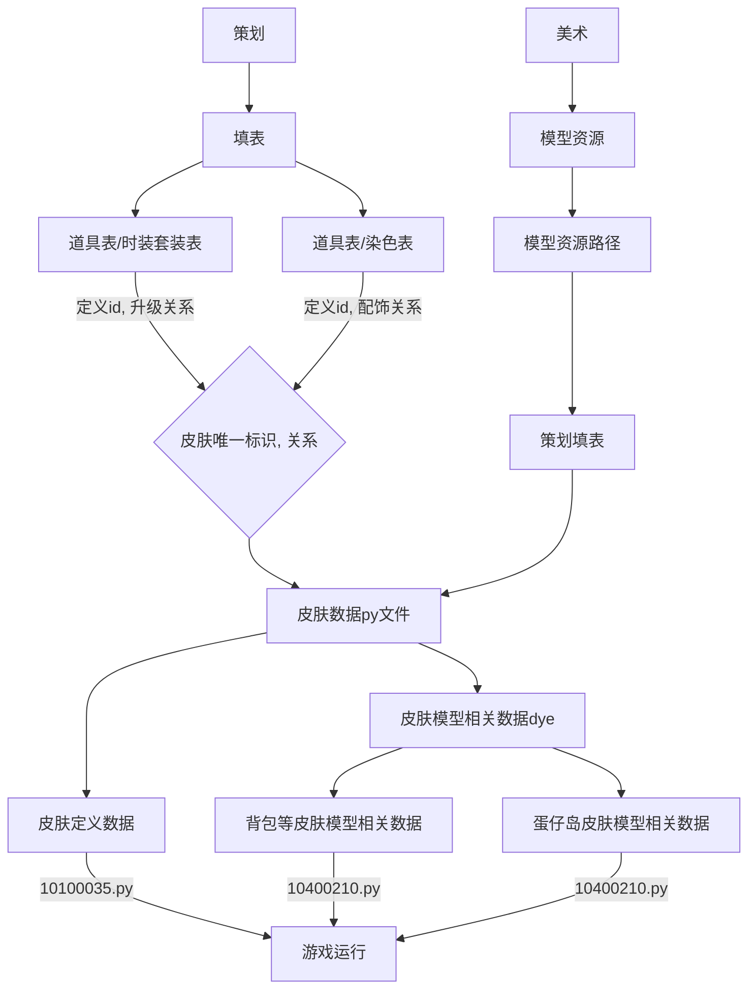

# 一个皮肤的诞生

```mermaid
graph TD


art["美术"]

designer["策划"]

  

RESOURCE_MODEL[模型资源]

RESOURCE_PATH[模型资源路径]

ACTION_FILL_EXCEL[填表]

  

FASHION_ITEM_EXCEL[道具表/时装套装表]

DYE_ITEM_EXCEL[道具表/染色表]

PY_DATA[皮肤数据py文件]

  

GAME[游戏运行]

MIXED_STEP1{皮肤唯一标识, 关系}

  

art --> RESOURCE_MODEL

designer --> ACTION_FILL_EXCEL

  
  

ACTION_FILL_EXCEL --> FASHION_ITEM_EXCEL

ACTION_FILL_EXCEL --> DYE_ITEM_EXCEL

  
  

FASHION_ITEM_EXCEL --定义id, 升级关系--> MIXED_STEP1

DYE_ITEM_EXCEL --定义id, 配饰关系--> MIXED_STEP1

  

MIXED_STEP1 --> PY_DATA

RESOURCE_MODEL --> RESOURCE_PATH --> DISIGNER_FILL_PY[策划填表] --> PY_DATA

  
  

FASHION_PY_DATA[皮肤定义数据]

DYE_PY_DATA[皮肤模型相关数据dye]

LOW_DYE_PY_DATA[蛋仔岛皮肤模型相关数据]

HIGH_DYE_PY_DATA[背包等皮肤模型相关数据]

  
  

PY_DATA --> FASHION_PY_DATA

PY_DATA --> DYE_PY_DATA

DYE_PY_DATA --> HIGH_DYE_PY_DATA

DYE_PY_DATA --> LOW_DYE_PY_DATA

  
  

FASHION_PY_DATA --10100035.py--> GAME

HIGH_DYE_PY_DATA --10400210.py--> GAME

LOW_DYE_PY_DATA --10400210.py--> GAME

```
