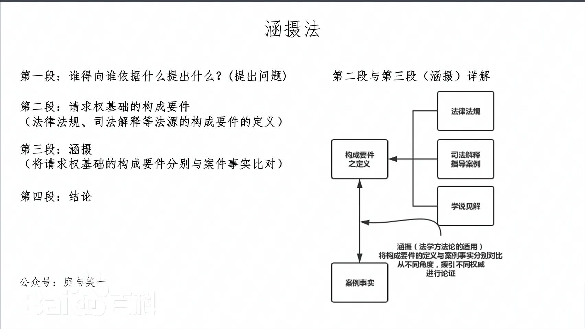

- 疫疠(yi4,li4)：瘟疫
- 条分缕析：一条一条地详加分析；也形容分析细致并有条理。
- 涵摄能力：
  - 涵摄，也叫摄于或包摄。就是指确定生活事实与法律规范之间的关系的思维过程（subsumption），将事实涵摄于法律规范，就是检验事实是否满足法律规范的事实构成并因此产生该规范所规定的法律后果。
  - 涵摄这样的过程通常由许多复杂的思维步骤组成。是法律规定与事实之间的对应关系，任何一个法律行为或事件都要对应相应的法律规定。
  - 法律适用的涵摄：即将具体的案例事实（Sachverhalt=S），置于法律规范的要件（Tatbestand=T）之下，以获得一定结论（R）的一种思维过程。
  - 涵摄的过程，即“目光往返于规范与生活事实之间”。
  - 涵摄的具体做法：首先，检查是否有构成要件之定义的立法或司法解释，如果没有或是不清晰，方可参考学说见解。其次，将构成要件定义与案件事实分别进行比对，从不同角度援引权威进行论证。
	
	

