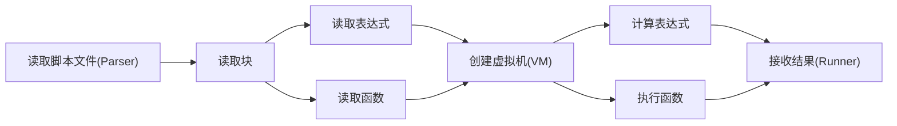
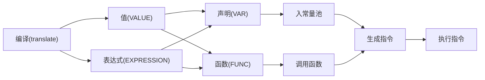

**指令规划**
0          7          15         23         31
+----------+----------+----------+----------+
|   CMD    |   IVAL   |   REG1   |   REG2   |
+----------+----------+----------+----------+
CMD:  机器指令码
IVAL: 局部变量表索引
REG1: 操作寄存器1
REG2: 操作寄存器2

**设计思路**

**表达式计算框架**

**指令执行过程**

