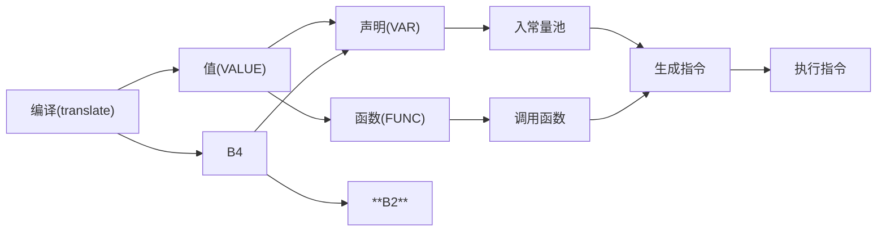

**表达式计算框架**

```mermaid
graph LR
A["编译(translate)"]
B1["声明(VAR)"]
B2["函数(FUNC)"]
B3["值(VALUE)"]
C["生成指令"]
A-->B3-->B1
B3-->B2
A-->B4-->B1
B4-->**B2**
B1-->C1["入常量池"] --> C
B2-->C2["调用函数"] --> C
C --> D["执行指令"]
```