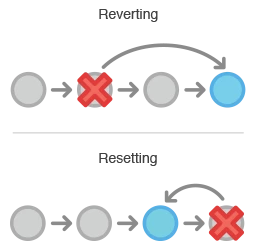

**Git相关**  
参考资料：  
https://www.jianshu.com/p/2d74a6f41d07
Git中文开发手册 https://www.php.cn/manual/view/35002.html  
《Pro Git》  
数据模型 https://eagain.net/articles/git-for-computer-scientists/

**Git的基本特性**
Git只关心文件数据的整体是否发生变化，而大多数其他系统则只关心文件内容的具体差异。
- 直接记录快照，而非差异比较
- 近乎所有操作都是本地执行
- 多数操作仅添加数据
- 时刻保持数据完整性
> Git 使用 SHA-1 算法计算数据的校验和，通过对文件的内容或目录的结构计算出一个 SHA-1 哈希值，作为指纹字符串。该字串由 40 个十六进制字符（0-9 及 a-f）组成，看起来就像是：``` 24b9da6552252987aa493b52f8696cd6d3b00373 ```

# 1.通过Git的模型掌握Git的使用方式
**掌握并了解Git的对象模型(数据结构表示)、分支历史对象模型、文件生命周期。**
- 1.Git的对象模型：tree、commit、blob
	``` python
	// 文件就是一组数据
	type blob = array<byte>
	// 一个包含文件和目录的目录
	type tree = map<string, tree | blob>
	// 每个提交都包含一个父辈，元数据和顶层树
	type commit = struct {
		parent: array<commit>
		author: string
		message: string
		snapshot: tree
	}
	type object = blob | tree | commit

	objects = map<string, object>

	def store(object):
		id = sha1(object)
		objects[id] = object

	def load(id):
		return objects[id]
	```
- 2.Git中文件流转的三个工作区域、文件生命周期的四个状态
  - 三个工作区域：working area | staging area | git directory(repository)
    -   
  - 四个文件状态：untracked | unmodified | modified | staged
    - 
  - 在单分支下，所有的控制方式，全部都是针对文件的生命周期做变化。
- 3.Git的分支历史对象模型（参考Git的数据模型）。
  - 学会Git的分支开发方式：长期开发分支、特性(topic)分支

**其他问题**  
1. Git中没有被指向的node(提交)可以使用git gc进行垃圾回收。git fsck --lost-found进行查找。
2. 一旦分支中的提交对象发布到公共仓库，就千万不要对该分支进行衍合操作。

# 2.掌握Git的基本配置方式
**本节末尾处并包含一些常见的问题**

- 配置文件的修改与查看
  - /etc/gitconfig Windows在安装目录。
  - ~/.gitconfig Windows在用户目录下。
  - 使用命令配置、查看配置文件、获取帮助
	```
	git config --global user.name "xxx"
	git config --global user.email "xxx"
	git config --list
	git config xxx.xxx
	git help ...
	```
- 使用.gitignore可以忽略某些文件
  - 文件名的使用方式遵循 **glob pattern**（#开头与空行将被忽略）
  - 使用!代表反义、结尾处添加/代表指明文件夹(会忽略文件夹下所有文件)
  > 所谓的 glob 模式是指 shell 所使用的简化了的正则表达式。星号（*）匹配零个或多个任意字符；[abc] 匹配任何一个列在方括号中的字符（这个例子要么匹配一个 a，要么匹配一个 b，要么匹配一个 c）；问号（?）只匹配一个任意字符；如果在方括号中使用短划线分隔两个字符，表示所有在这两个字符范围内的都可以匹配（比如 [0-9] 表示匹配所有 0 到 9 的数字）。
- Git配置相关的一些常用技巧与方式
	- 自动补全，contrib/completion 目录，会看到一个 git-completion.bash，加入.bashrc（windows自带处理）
	- 别名：git config --global alias.br branch
	
# 3.依托于1，了解如何进行增删查改，文件、分支（包括本地与远程）
**最简单的流程是**：init、add、commit
- 仓库的增删查改
  - 增：本地（init）、远程（clone）、github（fork）
  - 删：直接删除文件夹。
- 文件在工作区和暂存区的增删查改
	> 必须掌握git行为（用户使用命令修改）和修改行为（用户自然修改）对文件状态的影响、文件所处工作区的移动方式。
  - 增：add
  - 删：rm、rm --cached
  - 查：diff
  - 改：restore、restore --staged、reset、checkout
    - restore、restore --staged：
    - reset：
    - checkout：
	> 必须掌握改动的原理
- 删
  - 移除暂存区git rm、取消跟踪git rm --cached、checkout、reset
  > https://www.cnblogs.com/kongbursi-2292702937/p/15020513.html  
  rm：删除工作区文件。+git add，commit。删除工作区+版本库文件。  
  > git rm：删除工作区文件，删除记录放入暂存区，提交后删除工作区+版本库文件。  
  > 文件修改后，git rm会报错。-f。删除记录放入暂存区  
  > git rm --cached：删除暂存区文件，保留工作区。  
  > git reset：（三个步骤：改变HEAD的commit版本、1+index区域更新为HEAD、1+2+working区域更新为HEAD）会修改版本历史，丢弃一部分版本历史。  
  > git reset ... file：相当于把某个文件恢复到index区域中。
  > git revert:
  >   
  > git checkout file：更新index、working的内容。
- 查
  - 当前文件状态status、历史提交记录状态log(或者show)、变化状态diff
- 改
  - 修改当前提交记录的日志(--amend)、修改分支或文件checkout [branch] [file]
  - 合并记录(merge)、rebase
  - merge 命令，它会把两个分支最新的快照（C3 和 C4）以及二者最新的共同祖先（C2）进行三方合并，合并的结果是产生一个新的提交对象
  - rebase 命令，就可以把在一个分支里提交的改变移到另一个分支里重放一遍。
    > git rebase --onto master server client

- 通用标记
  - --cached：暂存区相关处理

# 4.依托于3，如何进行分支开发

# 5.Git提供的便捷功能

## 3.使用Git的远程仓库，以及对应的标签功能
```
git clone: 会建立你自己的本地分支 master 和远程分支 origin/master，并且将它们都指向 origin 上的 master 分支。
git fetch origin
git remote add
推送本地分支
git push origin branchname  // git push origin serverfix:serverfix
git push origin serverfix:awesomebranch 命名不同
协同远程分支
git checkout -b serverfix origin/serverfix 可以在远程分支的基础上分化出一个新的分支来
从远程分支 checkout 出来的本地分支，称为 跟踪分支 (tracking branch)。
git checkout -b [分支名] [远程名]/[分支名]
git checkout --track origin/serverfix （简化）
删除远程分支
git push origin :serverfix
git push [远程名] [本地分支]:[远程分支] 语法，如果省略 [本地分支]，那就等于是在说“在这里提取空白然后把它变成[远程分支]”。
```

## 4.了解分支


使用rebase压缩提交
http://t.zoukankan.com/dazhan-p-9289667.html


## 一些常见的问题
- 1.git status中出现的中文问题。
  - https://stackoverflow.com/questions/4144417/how-to-handle-asian-characters-in-file-names-in-git-on-os-x
  - git config --global core.quotepath false
  > Git quotes any non-ascii character by default, not only asian ones. There's an option to disable this quoting behaviour.  
  > Git 将任何非ascii字符使用引号包裹，可以使用这个操作取消这个默认操作。
- 2.diff文件的对应乱码处理问题
  - https://stackoverflow.com/questions/777949/can-i-make-git-recognize-a-utf-16-file-as-text
- 3.批量重命名git的文件
  ``` git
  for i in *.md; do git mv $i "重构相关书籍/"; done
  ```