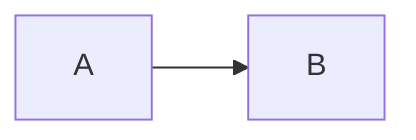
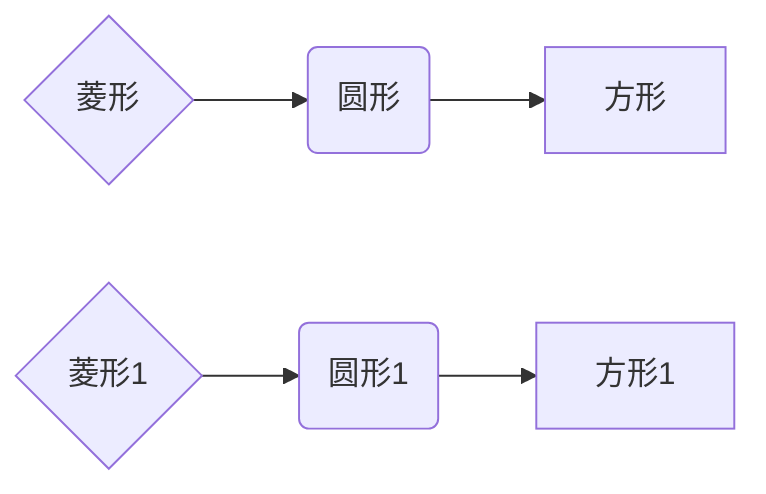
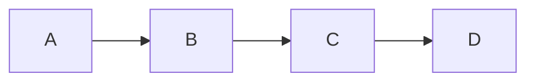

**目的**：我希望通过这个笔记，能够掌握以下内容
1. 快速地掌握使用memaid基本绘制流程图的方式（flowchart/graph）
2. 随时能够**通过在线编辑网站**绘制流程图

[官方网站](https://mermaid.js.org/intro/n00b-gettingStarted.html) https://mermaid.js.org/intro/n00b-gettingStarted.html

[在线Mermaid](https://mermaid.live/) https://mermaid.live/

## 1.绘制流程图

**基本样例**
- 第一个graph

- 第一个flowchart

---

**图的定义（markdown、基本语法结构）**
- 代码块的表示 + mermaid
- 定义图的结构
	- graph或者flowchart关键字
	- 方向：LR、RL、TD/TB、BT

****

**形状**
- 使用方括号[]长方形、圆括号()圆形、大括号{}菱形

***
**注释：%%**
**打断流程图、时序图**: 'End'
**Unicode**: "
定义流程图结点的文本允许markdown语法（使用双引号）：markdown["`This **is** _Markdown_`"]
**结点定义**
**连接关系、连接的形状**

