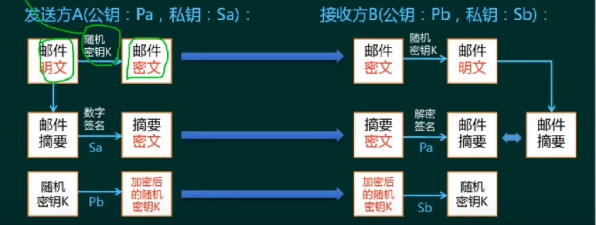
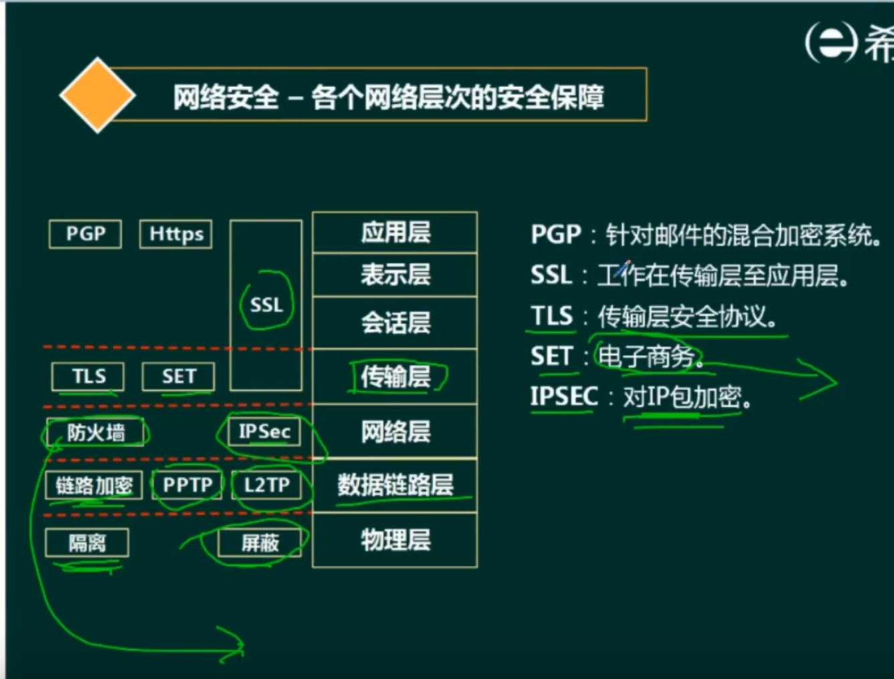
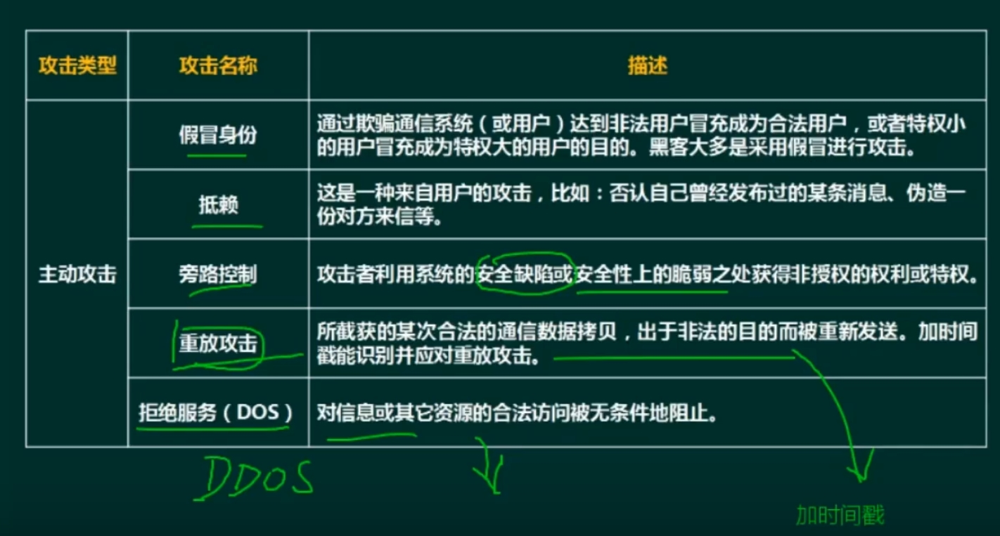
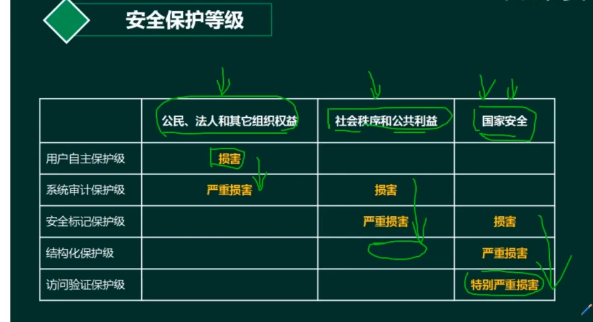
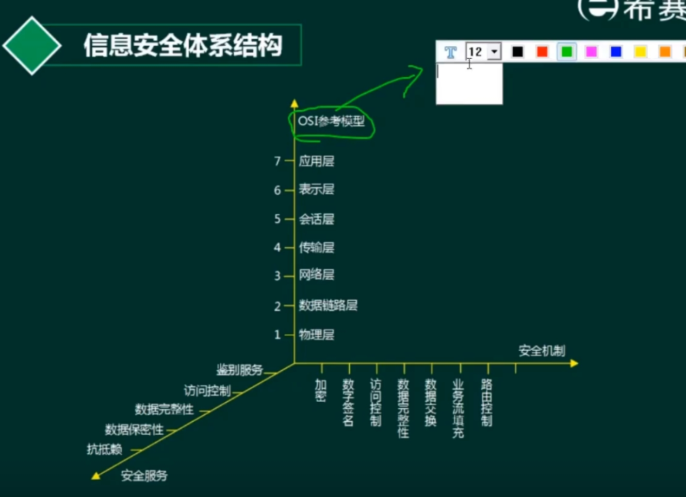

- 安全技术基础
  - 对称与非对称加密 ⭐⭐⭐
  - 数字签名 ⭐⭐⭐
  - 信息摘要 ⭐⭐⭐
    - 信息摘要作为数字签名-->保证是某个人发的。
- 网络安全
  - 安全协议 ⭐⭐⭐
  - 网络攻击 ⭐⭐
  - 等级保护标准 ⭐⭐

# 安全技术基础

## 对称与非对称加解密
- 对称
  - 加密强度低，但效率高
  - 密钥分发困难
  - 例子：
    - DES（3DES）、RC-5、IDEA算法、AES
- 非对称
  - 密钥分发

## 数字签名
- 功能：识别发送者的身份，防抵赖
- 私钥用于做签名，以及解密
- 1.A向B发送信息msg，先使用Sa加密，可以通过Pa解密。-->使用Sa做签名。
- 2.B使用Pa发现可以解密，说明这个是A发送的。-->Pa可以验证签名。

## 信息摘要
- 例子：MD5、SHA（128、160）

## 设计安全邮件传输系统
- 该邮件以加密方式（加密解密技术）传输，邮件的最大附件内容可达2GB（对称加密），发送者不可抵赖（数字签名），若邮件被第三方截获，第三方无法篡改（信息摘要）。
- 
- 还是不够安全
  - Pb的发送过程中，替换为Pc。
  - 公钥和持有人的身份信息绑定

## 数字证书
CA机构(Certificate Authority)
RA：注册审批
- 证书的**版本信息**
- 证书的**序列号**，每一个证书都有一个唯一的证书序列号。
- 证书所使用的签名算法
- 证书的发行机构名称
- 证书有效期
- 证书所有人的名称
- **证书发行者对证书的签名**

使用CA中心的公钥，来验证数字证书的真伪。

- PKI公钥体系
  - CA、RA、证书受理点、密钥管理中心-KMC

# 网络安全

## 安全协议
## 网络攻击
- 被动：收集信息为主，破坏保密性
  - 窃听、业务流分析、非法登录
- 主动：中断（破坏可用性）、纂改（破坏完整性）、伪造（破坏真实性）
  - 
## 等级保护证书 

> 范围、损害级
- 用户自主保护级（普通内联网）
  - 公民、法人和其他组织
- 系统审计保护级（内联网、国际网 商务）
  - 严重
- 安全标记保护级（地方机关）
- 结构化保护级（中央级、广播）
- 访问验证保护级（国防

五大安全服务
- 鉴别服务
  - 用户名、口令
  - 数字证书
  - 生物特征识别
- 访问控制
  - 自主访问控制：主体指定客体的访问权
  - 访问控制列表：对客体指定允许的主体（回帖查看下载地址）
  - 强制访问限制：主体客体分级（通行证等级）
  - 基于角色的访问登录：角色-->权限
  - 基于任务的访问控制：特定任务-->权限
- 数据完整性
  - 阻止对媒体访问的机制：隔离、访问控制、路由控制
  - 探测非授权修改的机制：数字签名、数据重复、数字指纹、消息序列号
- 数据保密性
  - 通过禁止访问提供机密性
  - 通过加密提供机密性
- 抗抵赖
  - 数字签名

