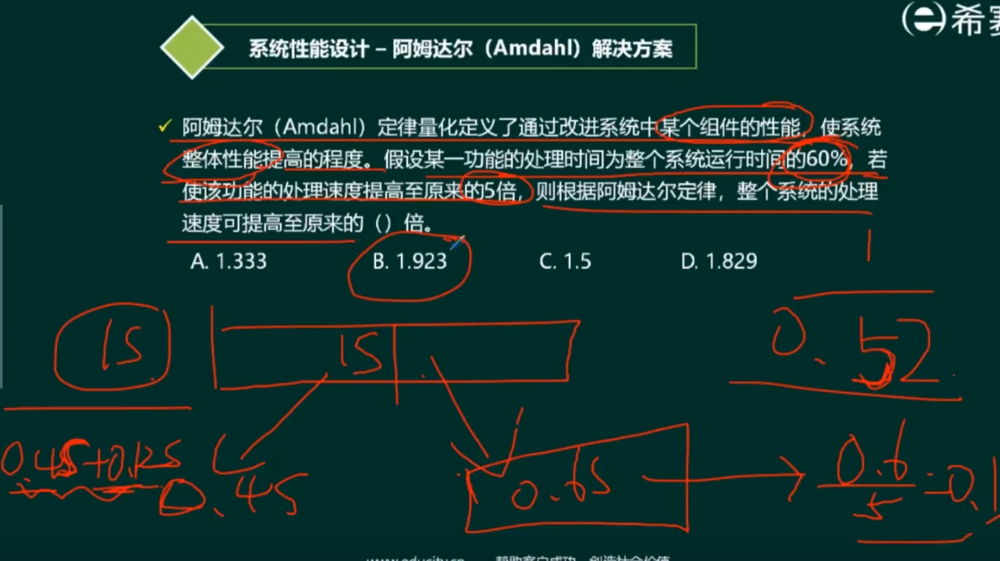

- 性能指标 ⭐
- 阿姆达尔解决方案 ⭐⭐⭐
- 性能评价方法 ⭐⭐

## 性能指标
- 字长和数据通路宽度
- 主存容量和存储速度
- 运算速度
  - 主频/CPU时钟周期
  - CPI与IPC
  - MIPS = 指令条数/（执行时间*10^6） = 主频/CPI = 主频 * IPC
  - MFLOPS = 浮点操作次数 / （执行时间*10*6）
- 吞吐量与吞吐率
  - 一定时间内处理的任务
  - 单位时间-->吞吐率
- 响应时间RT
- 与完成时间
- 兼容性

## 阿姆达尔解决方案

1/(xxxx)

## 性能评价方法
- 时钟频率法
- 指令执行速度法
- 等效指令速度法（不同指令）
- 数据处理速率法
- **综合**理论性能法
  - MTOPS
- 基准程序法
  - 基准测试程序（评估的核心程序）
  - 核心程序（用到最多的程序）
  - 最好：真实的程序、核心程序（核心的部分）、小型基准程序（较小的核心程序）、合成基准程序（自己定义的功能）
    - Dhrystone
    - Linpack
    - Whetstone
    - SPEC 最快
    - TPC
      - A （OLTP
      - B （事务处理
      - C （联机

