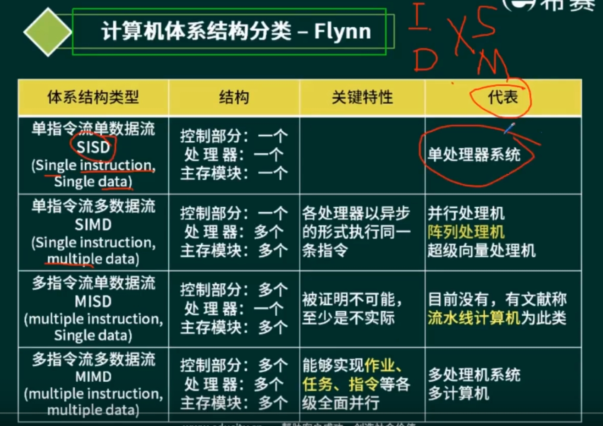
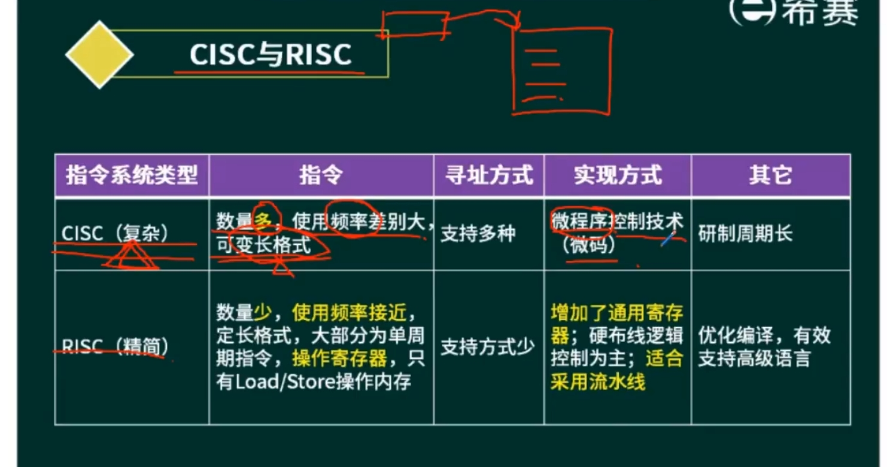
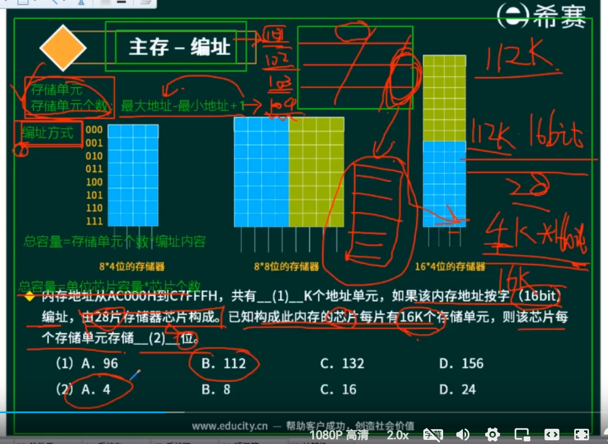
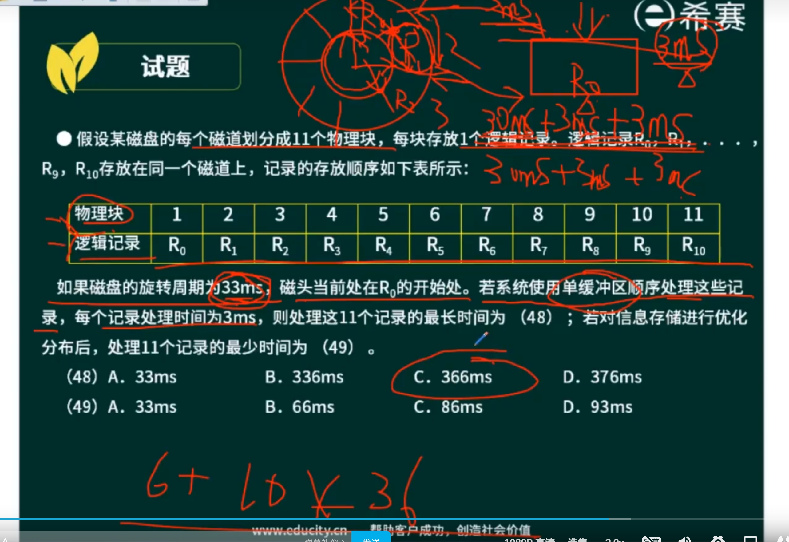
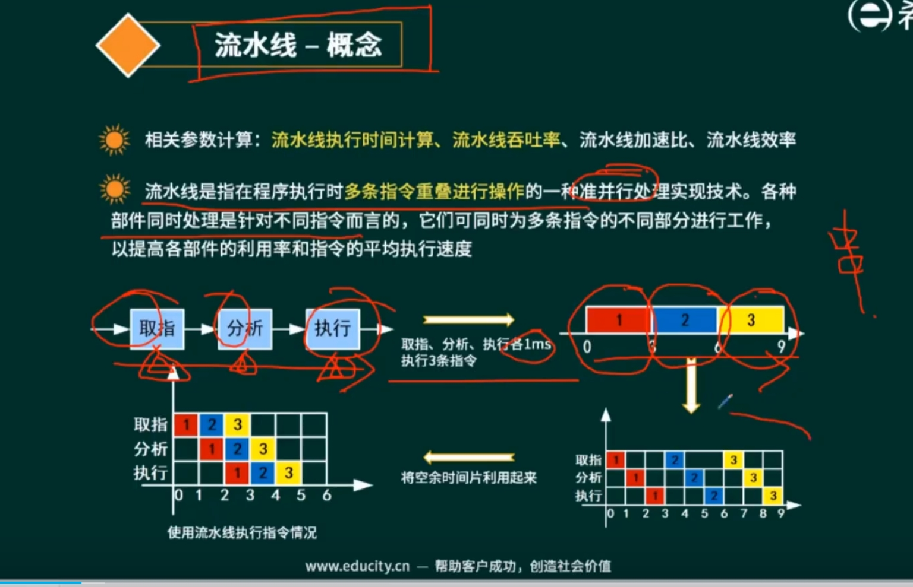
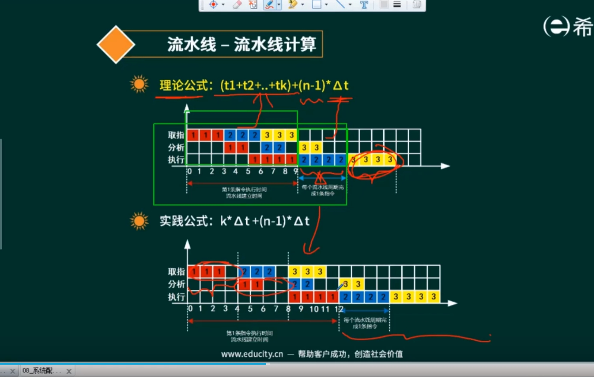
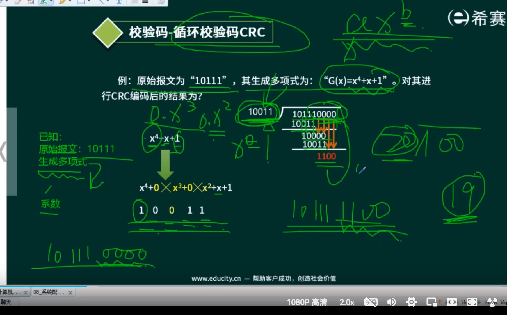

- [Flynn分类法](##Flynn分类法) ⭐⭐
- [CISC与RISC](##CISC与RISC) ⭐⭐
- [冯诺依曼结构与哈佛结构](##冯诺依曼结构与哈佛结构)
- [存储系统](##存储系统) ⭐⭐⭐
- [流水线技术](##流水线技术) ⭐⭐
- [校验码](##校验码) ⭐⭐
- [嵌入式系统](##嵌入式系统) ⭐⭐⭐⭐

## Flynn分类法

- 了解代表系统即可
- 记录单、多，其他输入单多。

## CISC与RISC

> 维度：指令数量、寻址方式、实现方式、其他
- 复杂指令集计算机
  - 微程序控制技术（微码）
- 精简指令集计算机（单周期）
  - 只有Load和Store操作寄存器
  - 增加了通用寄存器，适合采用流水线。

## 冯诺依曼结构与哈佛结构
- 冯诺依曼架构（PC）
  - 普林斯顿
  - 指令和数据存储器并在一起
  - 数据总线 + 地址总线
- 哈佛架构（DSP）
  - 程序指令存储与数据存储分开的存储结构
  - 数据存储器、指令存储器
  - 四条
  - 特点：并行存储，两个独立的存储器。

## 存储系统
- 层次化存储结构
  - CPU（寄存器）
  - Cache（按内容存储（相联存储器）
    - 非常快
    - 高速缓存
    - 目的：弥补不匹配，突破冯诺依曼瓶颈。（CPU与存储）
    - 理论依据：局部性原理。
    - h 90%以上
      - t1在cache、t2代表在主存
      - 平均时间 t3 = h(t1) + (1-h)*t2
    - 局部性原理：
      - 时间局部性：某条指令，不久后再执行
      - 空间局部性：某个存储单元，附近的存储单元未来的一段时间
      - 工作集理论：工作集是在进程运行时被频繁访问的**页面集合**。
  - 内存（主存）
    - 存储器分类
      - 随机存储器
        - DRAM（动态RAM、SDRAM），一般来说用这个。
        - SRAM（静态），晶体管，贵。
      - 只读存储器（BIOS，不会丢失）
        - MROM（掩模式ROM）
        - PROM（一次性可编程ROM）
        - EPROM（可擦除ROM）、EEPROM（电擦除）
        - 闪速存储器（flash Memory）
    - 主存——编址
      - 
      - 1.存储单元个数：最大地址-最小地址+1
      - 2.总容量：存储单元个数*编址内容
        - 3.总容量 = 单位芯片容量 * 芯片个数
      - 4.编址方式
        - 按字节编址（8位）
        - 按字编址
  - 外存（辅存）
    - 磁盘结构与参数
      - 结构：磁头、磁道、扇区
        > 磁盘一直在旋转
      - **存取时间** = 寻道时间 + 等待时间（平均定位时间+转动延迟）
        - 寻道时间：磁头移动到磁道所需时间
        - 等待时间：等待读写的扇区转到磁头下方所用的时间（转动）
        - 平均存取时间（一般不考虑）
      - 过程
        - 1.首先垂直方向上，寻道。
        - 2.然后旋转，寻找扇区
      - 例题
        - 
        - 理论上最优：(3+3) * 11
    - 磁盘结构2
      - 多盘面、杆、读写磁头
      - 调度算法
        - 移臂调度算法
          - 柱面/磁道（可以理解磁道整个柱面算一个）
        - 1.FCFS先来先服务
        - 2.SSTF最近的
        - 3.电梯算法，扫描算法，单方向（双向和单向）

## 流水线技术

> 时空图，效率：占的比例。
- 相关参数计算：`流水线执行时间计算`、`流水线吞吐率`、**流水线加速比**、流水线效率
  - 流水线执行时间计算：
    - 基本思想：1个流水线 + (n-1) * 1（单个）
    - 流水线建立时间-->
    - `流水线周期`-->执行时间最长的一段
    - 理论公式：(t1+t2+..+tk)+(n-1)Δt
    - 实践公式：k*Δt（直接取最长做冗余，流水线建立也简单） + (n-1)Δt
    - Δt是流水线周期
    - 
    - 其他
      - 超标量流水线（成组扩展
        度（流水线个数）
  - 流水线吞吐率（条/s）：单位时间内流水线完成的任务数量或输出的结果数量
    - TP = 指令条数 / 执行时间
    - 流水线最大吞吐率 TPmax = Lim(n->∞) n / (k+n-1)Δt = 1 / Δt
      - 流水线周期的倒数
  - 加速比计算
    - S = 不使用流水线执行时间/使用流水线执行时间
- 流水线是指在程序执行时`多条指令重叠进行操作`的一种并行处理实现技术。
  - 各种部件同时处理是针对不同指令而言的，它们可同时为多条指令的不同部分进行工作，以提高各部件的利用率和指令的平均执行速度。
- 总线（半双工）
  > 半双工：一个人发送，多个设备接收。
  - 分类：
    - 数据总线
    - 地址总线：指定RAM
    - 控制总线
  - 特点

## 校验码
- 奇偶校验
  - 编码方法：若干为有效信息 + 二进制（校验位） 组成校验码
  - 奇校验：凑奇
  - 偶校验：凑偶
- 循环冗余校验CRC
  - 可检错，不可纠错
  - 模2除法相关
    - 不借进位
    - 异或过程
    - 余数位数被（除数）限制
  - 生成多项式-->找到系数
  
    - 补余数啊...
  - 计算过程
    - 1.生成多项式-->系数-->作为除数
    - 2.补0的个数-->最高除数
    - 3.模2除法计算
    - 4.最终结果：信息位+余数
  - 验证：收到，整除，说明正确。
- 海明校验码
  > 海明校验，可检错，也可纠错
  $$ 2^r \ge m + r + 1 $$
  - 校验位公式
  - 矫错：收到的信息，跟校验位做异或，得到出错位置（取反即可）

## 嵌入式系统
- DSP（DSP芯片）
  - 特别适合于数字信号处理的计算的微处理器
  - 其主要应用：**实时快速地实现各种数字信号处理算法**
- SoC
  - 有专用目标的集成电路（完整系统）
  - 狭义角度：信息系统核心的芯片集成，是将系统关键部件集成在一块芯片上；
  - 广义角度：SoC是一个微小型系统，如果说中央处理器(CPU)是大脑，那么SoC就是包括大脑、心脏、眼睛和手的系统。
- MPU
  - 微机的中央处理器，构成微机的核心部件，也可以说是微机的心脏。起到控制整个微型计算机工作的作用，产生控制信号对相应部件进行控制，并执行相应的操作。
- MCU
  - 微控制单元，单片微型计算机，或单片机。

**交叉开发环境**
- 宿主机、目标机
- 交叉编译器
- 交叉链接器
- 调试器

**嵌入式系统的初始化过程**
- 片级（嵌入式微处理器的初始化）、板级（其他硬件）、系统级（软件）

