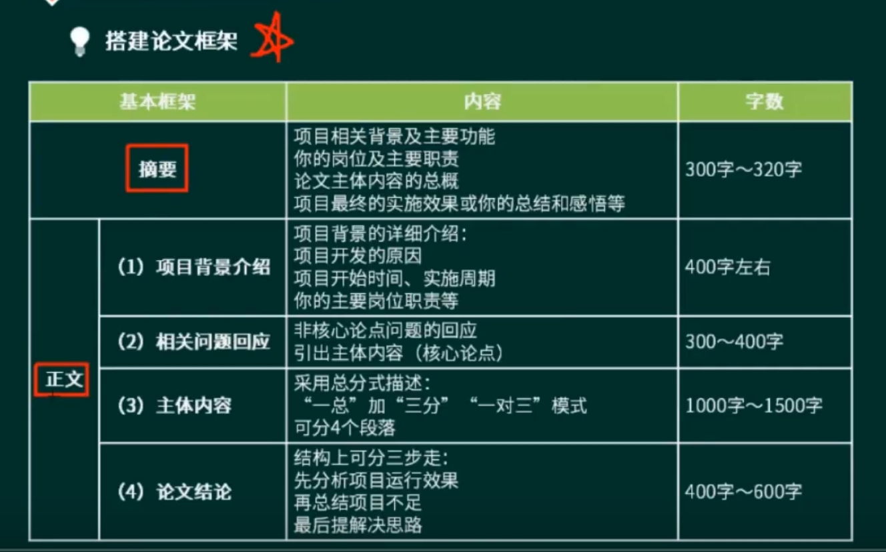
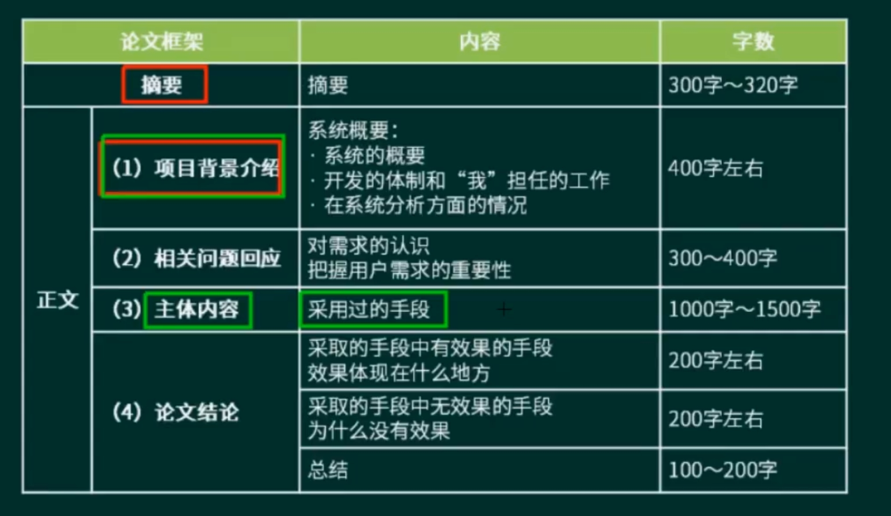

**考试大纲**
- 系统建模
- 软件架构设计
- 系统设计
- 分布式系统设计
- 系统可靠性分析与设计
- 系统安全性和保密性设计

# 1
- 注意事项
  - 论文 = 心态 + 技巧 + 理论 + 实践
    - 心态（不要猜题）
    - 技巧（沟通技巧、将问题表达清楚的技巧）
    - 理论：技术方案的合理性
    - 实践：应用场景的合理性

- 论文写作四部曲
  - 找准**核心论点**（5分钟）（三个问题-->分析）
    - 项目背景、项目主题
    - 分析每个问题能够和**技术实践**相关的。
  - 搭建论文框架（10分钟）
    - 项目背景介绍
    - 响应相关内容
    - 正文逻辑编排三个问题
    - 结论
  - 攥写摘要（15分钟）**重要，围绕核心内容**
  - 正文写作（90分钟）
- 论文架构
  - 
  - 项目背景介绍
    - 宏观背景
    - 微观背景
  - 相关问题的回应
    - 非核心论点问题的回应
    - 引出主体内容
  - 正文
    - 
  - 摘要编写
    - 

> 技术负责人

- 注意点
  - 以我为中心（自己做了什么工作）
  - 站在高级工程师的角度
  - 忠实于论点
  - 条理清晰、开门见山
  - 图文并茂，能收奇效
  - 标新立异、要有主见
  - 首尾一致
- 常见问题及解决办法
  - 走题
  - 字数不够(1800以下)、字数偏多
  - 摘要归纳欠妥
  - 文章深度不够，缺少特色，泛泛而谈
  - 文章口语化严重，文字表达能力太差
  - 文章缺乏主题项目，项目年代久远
  - 整篇文章从大123到小123，压抑感强
  - 文章结构不够清晰，段落太长

